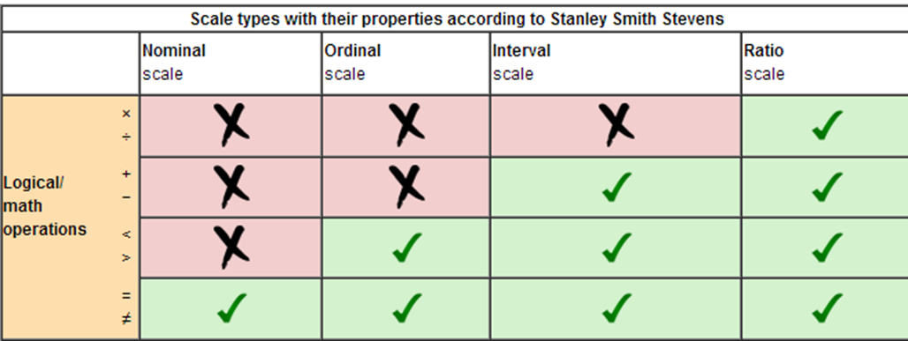
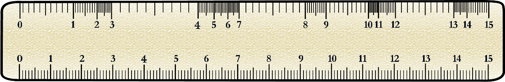
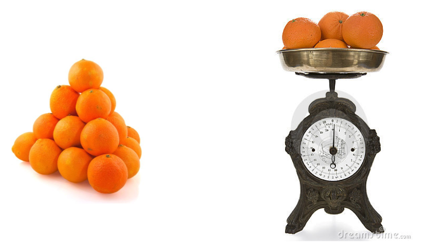
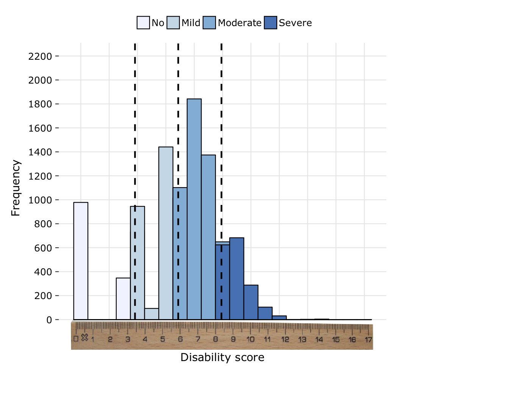
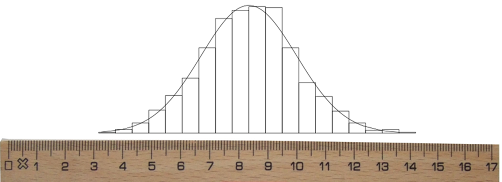
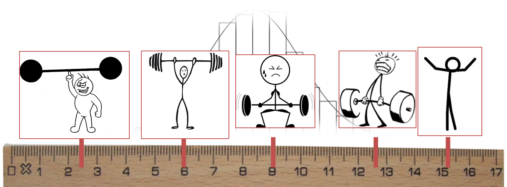
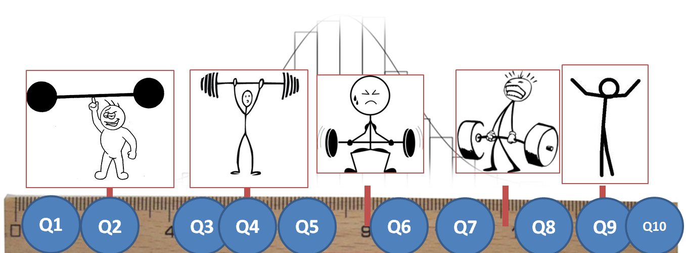
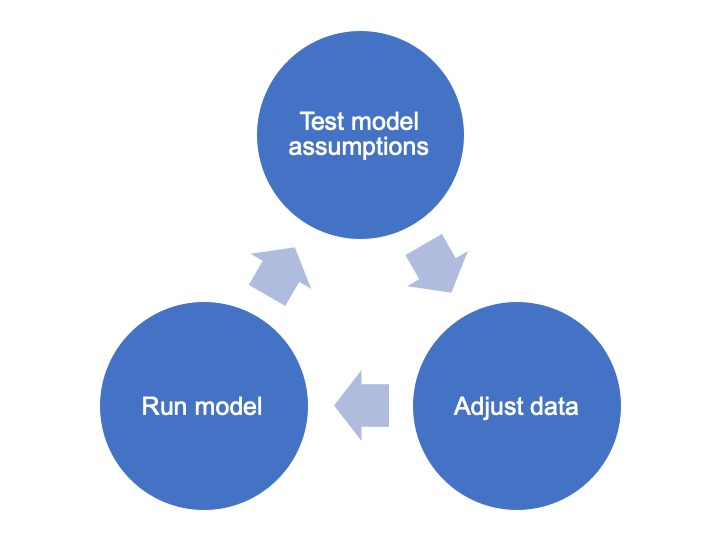
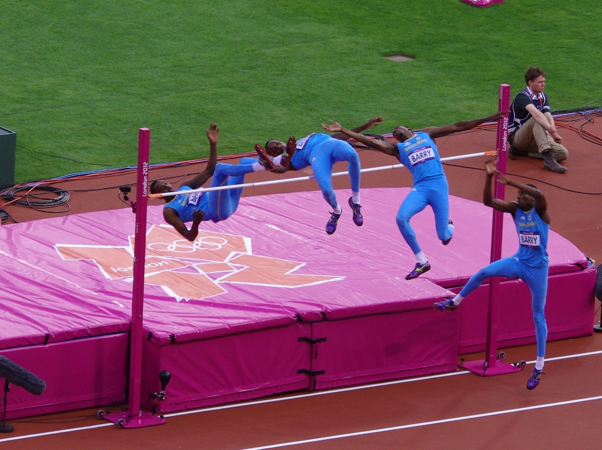
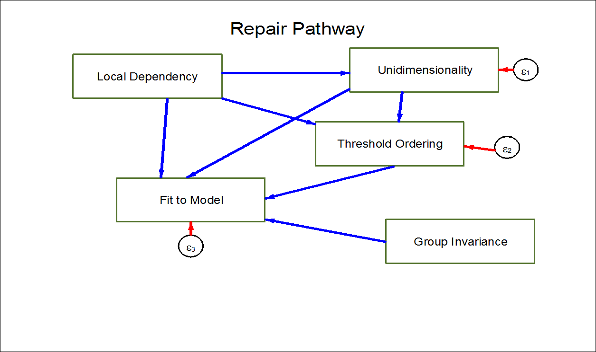

```{r setup, include=FALSE}
library(knitr)
library(tidyr)
library(dplyr)
library(ggplot2)
library(whomds)

options(survey.lonely.psu = "adjust")

opts_chunk$set(warning=FALSE, 
               message=FALSE, 
               eval=FALSE, 
               out.width = "80%",
               fig.align = "center",
               collapse = TRUE,
               comment = "#>")

```


# Introduction

## Background

In light of calls for sound and comprehensive disability data the Model Disability Survey (MDS) project was initiated by WHO and the World Bank (WB) in 2011. 

The MDS is grounded in the International Classification of Functioning, Disability and Health (ICF) and represents an evolution in the concept of disability measurement. It explores disability as the experience of a person with a health condition or impairment encountering a facilitating or hindering environment, instead of solely focusing on the individual's health status.

In keeping with the conceptual framework of the ICF, the MDS takes the approach that:

* Disability is not an internal attribute of a person but an experience;
* Disability is etiologically neutral;
* Disability is a continuum, a quantity, and a matter of degree, ranging from no disability to extreme disability;
* Disability is universal, meaning every person sits somewhere on the disability continuum.

The rationale behind the MDS requires therefore a general population sample and the use of no filters, i.e. no _a priori_ selection of respondents, with three main goals: 

* Achieving comparable and standardized disability prevalence rates across countries; 
* Delivering the needed data for designing appropriate interventions, programs and policies for persons with mild, moderate and severe levels of disability; 
* Monitoring the implementation of the Sustainable Development Goals (SDGs) and the United Nation Convention on the Rights of Persons with Disabilities (CRPD) by allowing for a direct comparison among persons with mild, moderate and severe levels of disability, and persons with no disability.

The MDS takes the approach that disability is a universal phenomenon characterized by a continuum ranging from low to high disability levels. This conceptualization requires information on disability to be reported and analyzed using metrical scales. This scale will range from 0 (no disability) to 100 (extreme disability).

Following an approach similar to the one of the World Report on Disability (WRD) and using modern test theory, functioning questions of Module 4000 are used to build a disability scale with metric properties. The whole general population sample is used to create this metric, which is then linearly transformed to range from 0 (lowest level of disability) to 100 (highest level).

## Purpose of this guide

The WHO Disability Programme offers technical support to countries to guide successful implementation of the survey and to analyze the resulting data. This guide is part of this package of technical support. 

To create the disability scale, on which every individual in the same has a score from 0 to 100, WHO uses a technique called Rasch Analysis. The purpose of this guide is to explain in detail how Rasch Analysis is done and how to use the WHO package of codes, written in the statistical programming language `R`, in order to carry out the Rasch Analysis for the MDS.

## Objectives

1. Understand measurement and the information that different kinds of scales can provide;
2. Describe the reasoning and process behind Rasch Analysis;
3. Learn how to prepare data for a Rasch model;
4. Learn how to run a Rasch model;
5. Learn how to assess the quality of the Rasch model;
6. Learn how to adjust data to improve the quality of a Rasch model;
7. Understand how to use the package to calculate descriptive statistics.

# What is measurement?

At first glance, measurement seems very straight forward. However, the concept of "measurement" is actually made up of a few smaller components. It is important to understand each of these components when formulating any new measurement tool, like we are doing with the Model Disability Survey.

The main ideas of measurement are as follows:

* **Objects** have **properties** that can be thought in terms of more or less, larger or smaller, stronger or weaker.
* This **property** can be measured through its **manifestation** (or observable behavior).
* This **manifestation** can be mapped onto a **scale**.
* **Measurement** can have some **error** involved, and may not be perfectly precise.

For example, a person (**object**) has a certain intelligence regarding mathematics (**property**). This person's mathematical intelligence can be observed via their performance on a math test (**manifestation**). Their performance on the math test is given a score from 0 to 100 (**scale**). The score someone receives on a particular day can be influenced by random factors like their mood or the conditions of the room, so the score may not exactly reflect the person's true intelligence (**error**).

Just as there are different types of **properties** that objects can have (for example: height, weight, color, intelligence), there are also different types of **scales** that these properties can be measured with. Each of these different types of scales can give you different types of information, and you can only perform certain types of mathematical operations with each type of scale. 

The four main types of scales are:

* **Nominal scale** - This scale involves assigning names to objects. For example, on a survey we often identify people as "Male" or "Female". This would be considered a nominal scale. The only mathematical operation available for this scale is assessment of equality. In other words, with nominal scales, you can only determine if two objects are the same or they are not.
* **Ordinal scale** - This scale involves placing objects in a particular order. For example, on a survey you often have questions with response options as follows: "Disagree strongly", "Disagree", "Neither agree nor disagree", "Agree", and "Agree strongly". This would be an ordinal scale. There are two mathematical operations possible with ordinal scales: equality and more/less. For example, with this scale you can determine if two objects give equal responses (for example, two people both answer "agree" to a question on a survey) or if one person's answer is "greater" than another's. For example, if Person A answers "agree" and Person B answers "agree strongly", you can be certain that Person B agrees more to the item than Person A. However, you cannot determine the "distance" between items. In other words, taking our example, you do not know _how much more_ Person B agrees than Person A.
* **Interval scale** - This scale involves placing objects at positions that have meaningful order and distance relative to other objects. For example, the weather on two days can have two different temperatures. Let's say Day 1 has a temperature of 10 degrees Celsius and Day 2 has a temperature of 20 degrees Celsius. This is an example of an interval scale. With this scale, we can use three different mathematical operations: we can determine if two objects are equal, if one is greater than another, and also the relative distance between them. In our example, clearly Day 1 and Day 2 have two different temperatures, and Day 2 is hotter than Day 1. But even more than that, we can say that Day 2 is exactly 10 degrees Celsius hotter than Day 1. Unlike with an ordinal scale, the distance between two points on the scale is meaningful. However, we cannot determine ratios between two points on the scale. In our example, we cannot say that Day 2 was twice as hot as Day 1. This is because 0 degrees Celsius is arbitrarily placed. When it is 0 degrees outside, it is cold, but there still is a temperature present.
* **Ratio scale** - This scale is like an interval scale, except that it also has a meaningful "0" point. We can apply four different mathematical operations to this scale: the three from an interval scale in addition to multiplication/division. For example, imagine Person A is 100cm tall and Person B is 150cm tall. Clearly we can determine that Person A is not the same height as Person B, Person A is shorter than Person B, and Person A is 50cm shorter than Person B. But even more than that, because 0cm is meaningful, we can say that Person B is 50% taller than Person A. We can create a ratio between their heights. Unlike with temperature, we can say for certain where 0cm is--if something is 0cm tall, then it's not there!

The table below gives a summary of what kind of information is possible with each scale.

```{r plot-scales, eval=TRUE, echo=FALSE}

```


Most of the questions of the MDS are on a 5-point ordinal scale (for example, 1=None, 2=Some, 3=Moderate, 4=A lot, 5=Complete). In order to create a score we can use and trust, what we want to do is **take our ordinal data and map it onto an interval scale** of disability. In other words, using the ruler below as a reference, we want to move from the top of the ruler to the bottom.


```{r plot-ruler, eval=TRUE, echo=FALSE}

```


Why is simply adding up ordinal data not good enough? Imagine you are the CEO of a company that sells orange juice. You ask your employees, how much orange juice will we be able to produce this quarter? Employee A replies that the company has produced **5000 oranges** while Employee B replies that the company has produced **1500kg of oranges**. Who gave you the most information about how much orange juice you will be able to produce?

Employee B gave you information on an interval scale (weight), and Employee A gave you information on an ordinal scale (count). Employee B gave you more information; with her answer you know precisely how much orange juice you have to sell. Employee A told you how many oranges you have, but you have no idea how big or small they are.

```{r plot-oranges, eval=TRUE, echo=FALSE}

```


This scenario is similar to our questionnaire. We could just simply add up all answers to all the questions we are interested in to calculate a sum score. However, that sum score doesn't tell us much about the overall level of disability a person experiences, because we don't know which questions were identified as difficult, and different questions have different levels of difficulty.

For example, imagine that a person is answering questions from the Model Disability Survey. This person answered "3=Some problems" to both questions, "How much of a problem is toileting?" and "How much of a problem do you have with sleep?". One can imagine that difficulties with sleep are fairly common, and many of us experience problems with sleep without it impacting our lives too much. However, many fewer people have "some problems" with using the toilet, and one can imagine that having even some level of difficulty with using the toilet can cause significant problems in someone's life. Therefore, one can see that the answer of "3" to "sleep" is not equivalent to the "3" answered to "toileting".

So, in essence, we are trying to move from counting responses to questions about disability to truly measuring levels of disability on an interval scale. We will do this using **Rasch Analysis**.

# How does an interval scale apply to measuring disability?

Before we begin discussion of the technique of Rasch Analysis, it is important to emphasize again WHO's understanding of disability. We are measuring disability on an **interval scale**. This scale ranges from 0 (no disability) to 100 (extreme disability), and every person in the population sits somewhere on the scale. 

This is quite different from the traditional way of thinking about disability. Often, when people hear the word "disability" they think of different "types of disabilities", and the people that most quickly come to mind are, for instance, people who are blind, people who are deaf, or people who use wheelchairs. For WHO, the word "disability" does not refer to attributes of specific, narrow groups of people who have particular impairments. For WHO, "disability" refers to a universal experience--not an attribute of a person--which is the outcome of a multitude of factors, like an underlying health condition or the accessibility of an environment. 

As an example, take one person who has a vision impairment due to glaucoma and another person who has a mobility impairment due to a spinal cord injury. Both people may have difficulty using the transportation system. The person with a vision impairment may have difficulty using transportation because the names of the stops on the bus are not announced over the loud speaker, so the person cannot tell when she has reached her destination. The person with the mobility impairment may have difficulty using the transportation system because the buses do not have ramps that would allow her to alight independently with her wheelchair. Despite the fact that these two people have different types of impairments and run into different types of barriers, the _level of disability_ they experience is quite similar in this particular domain of transportation.

The output of Rasch Analysis will give us the disability score for each person in the sample. We can then plot these scores in a histogram to get an overall picture of the distribution of disability in a population. An example of such a distribution is below. You can think of the horizontal axis as a ruler. Each person sits somewhere on this ruler, and the heights of the bars tells how many people are at that particular position on the ruler.

```{r plot-distributionruler, eval=TRUE, echo=FALSE}

```

# Why should we use Rasch Analysis?

## Important properties

The main reason why we use Rasch Analysis has already been mentioned: it allows us to take ordinal data and map it onto an interval scale. However there are other important properties of the Rasch Model that make it a particularly useful method for our purposes:

* No assumptions are made about distribution of person abilities
* Difficulties of two items can be compared independently of abilities of the persons
* Abilities of two people can be compared independently of difficulties of items
* The difference between person abilities and item difficulties is a _sufficient statistic_ (see a statistical text for more information about sufficient statistics)

## Goals

Ultimately we have three main goals when performing Rasch Analysis:

1. Obtain person ability estimates
2. Know the difficulty of items on the scale
3. Create and **validate** an interval-scaled **reliable** measurement tool

Goal 1, in other words, gives us the disability scores we are looking for. Goal 2 tells us how "difficult" items are, meaning how indicative of different levels of disability (mild, moderate, severe) they are.

Goal 3 has to do with the psychometric properties of the survey instrument we are using. With Rasch Analysis, in addition to calculating the interval scale, we are simultaneously performing an analysis of the validity and reliability of the scale. If our data fit the model property, then we can be certain that the scores that we obtain for people and for items are valid (i.e., they are measuring what we intend for them to measure) and reliable (i.e., the survey instrument would give consistent results if the survey was repeated).

## Output

As already mentioned above, one of our aims is to obtain the person ability estimates. This means that an output of the Rasch analysis will be a latent trait continuum (shown below)...

```{r plot-continuum, eval=TRUE, echo=FALSE}

```

...where you can locate specific people...
```{r plot-continuum-person, eval=TRUE, echo=FALSE}

```

...and also the items!

```{r plot-continuum-personitem, eval=TRUE, echo=FALSE}

```

"Latent trait continuum" is another phrase to describe the scale. "Latent trait" refers to an underlying characteristic of the population that the survey instrument is measuring (in our case, disability). "Continuum" is simply another word for "scale", emphasizing that people can be placed at any point between the end points (0 and 100) of the scale.

The figure above is illustrating a toy example analyzing the strength of people and the difficulty of each item (questions Q1 to Q10) in regards to strength. The strongest person is on the left side of the continuum, while the weakest person is on the right side of the continuum. We can see that items Q9 and Q10 are the easiest; they are located on the same end of the continuum as the weakest person. The probability that the strongest people on the left end of the continuum get the questions "correct" is very high. Questions Q1 and Q2 are the hardest; only the strongest people, located on the same end of the continuum, have a reasonable probability of getting these questions "correct." 


# What is Rasch Analysis?

Rasch Analysis was named after Danish mathematician Georg Rasch (1901-1980). The fundamental idea of Rasch Analysis was summarized by Rasch as follows:

> ...a person having a greater ability than another person should have the greater probability of solving any item of the type in question, and similarly, one item being more difficult than another means that for any person the probability of solving the second item is the greater one.

This quote from Rasch refers to two situations:

1. If we have two people, Person A and Person B, and Person A has more disability than Person B, then Person A has a greater probability of rating any given item on the survey, for instance "walking 100m," as more difficult than Person B.
2. If we have two items, Item A and Item B, and Item A is more difficult than Item B, then any given person will have a higher probability of rating Item A as more difficult than Item B.

Rasch is one of the simplest models in **Item Response Theory (IRT)**. IRT is a **probabilistic** approach to measurement: the probability of a "correct" response to an item (i.e., question) is a function (i.e., relationship) of the parameters (i.e., characteristics) the person and the item.

Under the Rasch Model, the probability of a certain response to a measurement item is associated with the respondent's ability ($\beta_n$) and the item's difficulty ($\delta_i$). Using our previous example of a mathematics test, the person's ability $\beta_n$ would be the person's mathematical intelligence, and the item's difficulty $\delta_i$ would be the difficulty of any given question on the test.

There are two different versions of the model: the dichotomous version (all questions have two response options, for instance 0 and 1) and the polytomous version (questions have more than 2 response options). The polytomous model, which we are most interested in because in the MDS most questions use a 5-point scale ranging from "1=No problems" to "5=Extreme problems", is simply an extension of the dichotomous version. Below we give a basic overview of the models.

## The Rasch Model - Dichotomous

Below is the main equation for the dichotomous Rasch Model (two response options):

$$P(X_{ni}=1) = \frac{e^{\beta_n-\delta_i}}{1+e^{\beta_n-\delta_i}}$$

where

* $i$ - item counter
* $n$ - person counter
* $X_{ni}$ - random variable of score of person $n$ on item $i$
* $\beta_n$ - location of person $n$ on latent continuum
* $\delta_i$ - difficulty of item $i$ on latent continuum

In simpler terms, this means: the **probability** that person $n$ gets question $i$ correct is a **ratio** based on the difference between that person's ability ($\beta_n$) and the difficulty of that item ($\delta_i$).

This can be seen in the following figure. The vertical axis is the probability of the person getting a question correct ($P(X_{ni}=1)$), ranging from 0 to 1. The horizontal axis is the difference between a person's ability and the item difficulty ($\beta_n-\delta_i$). Let us say that this question has two options: 0 and 1, and a "correct" response to the item is the response option of 1. When the person's ability and the item difficulty are equal ($\beta_n-\delta_i=0$ or $\beta_n=\delta_i$), then the probability that the person gets the question correct is 50%. If the person's ability is higher than the item difficulty ($\beta_n > \delta_i$), then the probability that the person gets the question correct is greater than 50%. If the person's ability is less than the item difficulty ($\beta_n < \delta_i$), then the probability that the person gets the question correct is less than 50%. 

``` {r rasch-setup, echo=FALSE, eval=TRUE, out.width = NULL}

x <- seq(-5,5,0.01)
y <- exp(x)/(1+exp(x))
df <- tibble(x,y)

ggplot(df,aes(x=x,y=y)) + 
  geom_point() +
  labs(x="Difference between person ability\n and item difficulty", y="Probability of person getting\n question correct")+
  geom_hline(yintercept=1, color="red", linetype=2) +
  geom_hline(yintercept=0, linetype=2) +
  geom_vline(xintercept=0)

```

## The Rasch Model - Polytomous

The polytomous Rasch Model (more than 2 response options) is an extension of the dichotomous version. It is also known as the **Partial Credit Model**. The main equation for this model is:

$$P(X_{ni}=x) = \frac{e^{\sum^x_{k=0}(\beta_n-\tau_{ki})}}{\sum^{m_i}_{j=0}e^{\sum^j_{k=0}(\beta_n-\tau_{ki})}}$$
where

* $i$ - item counter
* $n$ - person counter
* $X_{ni}$ - random variable of score of person $n$ on item $i$
* $\beta_n$ - location of person $n$ on latent continuum
* $\tau_{ki}$ - $k^{th}$ threshold of item $i$ on latent continuum
* $m_i$ - maximum score for item $i$

In simpler terms, the **probability** that person $n$ gives answer $x$ to question $i$ is a **ratio** based on the difference between that person's ability ($\beta_n$) and the difficulty of each response option ($\tau_{ki}$) for that item.

This can be seen in the following figure, which is similar to the figure for the dichotomous model. The vertical axis is the conditional probability of the person achieving choosing a particular response option or higher ($P(X_{ni}>x)$), ranging from 0 to 1. The horizontal axis is the difference between a person's ability and the item difficulty. The key difference between this figure and the figure for the dichotomous model is that now we have a probability curve for each threshold. 

A **threshold** is the point between two adjacent response options where a person has a 50% chance of giving one response option or another. The figure below shows the case of four response options, which means this question has three thresholds (The 50% point between response options 1 and 2, the same point between options 2 and 3, and the same point between options 3 and 4).

In the figure below, you can see that the probability of passing the first threshold (red curve), in other words achieving a score of 2, is always higher than the probability of passing the second (green) or third (blue) threshold. This shows a key property of the polytomous Rasch Model: thresholds are **ordered**.


``` {r rasch-setup-poly, echo=FALSE, eval=TRUE, out.width = NULL}

x <- seq(-5,5,0.01)
tao <- c(-2.5,0,2.5)
y0 <- exp(x-tao[1])/(1+exp(x-tao[1]))
y1 <- exp(x-tao[2])/(1+exp(x-tao[2]))
y2 <- exp(x-tao[3])/(1+exp(x-tao[3]))
df <- tibble(x,y0,y1,y2)
df.long <- df %>%
  pivot_longer(!x, names_to = "Threshold", values_to = "y")

ggplot(df.long,aes(x=x,y=y,color=Threshold)) + 
  geom_point()+
  scale_color_discrete(labels=c("First","Second","Third")) +
  labs(x="Difference between person ability\n and item difficulty", y="Conditional probability of person\n passing response threshold")+
  geom_hline(yintercept=1, color="red", linetype=2) +
  geom_hline(yintercept=0, linetype=2) +
  geom_vline(xintercept=0)

```

# How do you do Rasch Analysis?

## Overview of the method

Everything we have described so far is background to the rationale of Rasch Analysis. However at this point we have not yet described how it is actually done.

Overall, the basic technique is to **fit our data to the Rasch Model**, taking note of how well it fits the **Rasch Model assumptions**. This differs from other types of modeling where you _fit a model to your data_. The Rasch Model is seen as the "ideal", and we want to adjust our data in such a way that it can fit this ideal. If our data can reasonably fit this ideal, then we can be assured we have a **valid** and **reliable** interval scale. 

Rasch Analysis is an **iterative process**, meaning it must be performed multiple times in order to reach a result. The process is shown in the figure below.

``` {r iteration, echo=FALSE, eval=TRUE}

```

The next question naturally is: what are the Rasch assumptions that we are testing?

## Rasch assumptions

The Rasch Model assumptions are as follows. Each assumption will be discussed in detail in the following sections:

1. Item independence
2. Unidimensionality
3. Stochastic ordering
4. Group invariance
5. Fit to model

We will also discuss below how to adjust data to have it better fit each assumption. These techniques might not make much sense now, but they will become clearer once we go through the example.

### Item independence

Item independence refers to uncorrelation between items. In other words, we want responses to one item to NOT be related strongly with responses in another item. Correlation happens when items are linked by common attributes, content, structures, or themes. For example, in the MDS two items that are often related are "How much of a problem do you have with feeling sad, low or depressed?" and "How much of a problem do  you have with feeling worried, nervous or anxious?"

In order to take care of problems with high correlation, we often aggregate dependent items into one "super item", or "testlet". For instance if we have two items, each with 5 response options, that are highly correlated, we could combine them into a testlet by adding up the responses for each person. This testlet would now have 9 response options.

### Unidimensionality

Unidimensionality refers to the situation when all items measure the same underlying single construct. In the case of the MDS, we want all items to be measuring the same underlying construct of "disability". A total score is only meaningful with a unidimensional scale.

Take another example in the educational field: Imagine a math test. All items on this test are measuring the same underlying construct, that is, the person's ability in math. If a math test also contained English literature questions, the scale created with all the items of this test would no longer be unidimensional because the test is composed of two totally separate sets of items.

If we notice problems with the dimensionality of our data, we can correct this by splitting items onto multiple scales. In our educational example above, this would mean creating a separate scale for the math questions on the test and a separate scale for the English questions.

### Stochastic ordering

Stochastic ordering refers to the thresholds (i.e., boundaries between response options) being in the correct order. We expect the probability of a person crossing the first threshold to be higher than the probability they pass the second, and likewise the probability of crossing the second threshold should be higher than the probability of crossing the third, etc. As an analogy, think of a high jump: if someone is able to jump over 1.5m, then they necessarily already jumped over 1m. Stochastic ordering is only relevant for items with more than 2 response options (polytomous case).

```{r plot-highjump, eval=TRUE, echo=FALSE}

```


If we have problems with stochastic ordering, we can recode response options in order to create fewer thresholds between items that are more likely to be in order. 

### Group invariance

Group invariance refers to items behaving similarly for people with different characteristics. For example, we want men and women to show similar patterns of responses for an item. If items show different behavior for different groups, this is referred to as "differential item functioning (DIF)".

For the MDS, because we expect men and women to experience different levels of disability, we are not too concerned with group invariance. This is the same for people of different ages, because the older we get, the higher the probability of experiencing disability in daily life.

If we want to correct for DIF, we can split items into subgroups. For instance instead of having one question Q1 for the whole sample, we can split it into two questions Q1_Men and Q1_Women.

### Fit to model

In addition to all the above assumptions, we also care about fit to the model. Fit of items, persons, and the model overall are measured with various fit statistics.

We determine:

* Do **items** fit the model? -> examine item fit
* Do **people** fit the model? -> examine person fit
* How is the model **overall**? -> examine reliability scores, like person separation index (PSI)

If items or people are showing poor fit to the model after making all other adjustments we could make, all that's left to do is delete items or people from the scale. This would be considered a last resort, as it means the scale you end up creating does not examine all the items or people you originally set out to measure.

## Why do I have to run the model multiple times?

It is very rare for the first model you run to give perfect results where everything fits. If your goal is simply to assess the validity and reliability of your questionnaire with the raw data, then you could run the model once and analyze those results. However if your goal is to obtain a valid and reliable score--as it is in the case of the MDS--then it is most often necessary to run the model multiple times, making adjustments to the data each time. We are trying to find a way to fit the data to the Rasch "ideal", in other words to create a score that adheres to these basic assumptions built in to the Rasch model. The fact that you must run the model multiple times does not at all necessarily mean there is something wrong with your questionnaire. The Rasch Analysis process simply tells you how best to utilize survey instrument you have to create the most trustworthy score.

## Where do I start? {#repair}

The figure below shows the repair pathway for the Rasch Model. Overall, you can see that all of these assumptions can affect the performance of other assumptions. However, general guidance about what order to use when adjusting data can be determined. 

```{r plot-repair, eval=TRUE, echo=FALSE}

```


Local dependency (or item independence) affects unidimensionality, threshold ordering (or stochastic ordering) and the fit to the model, so it is good to start by taking care of item independence first. Unidimensionality affects threshold ordering and the fit to the model, so it's a good assumption to take care of second. Threshold ordering affects the fit to the model, so it can be taken care of third. Finally, group invariance only affects fit to the model, so it can be taken care of last. 


## How do I know when I'm done?

Determining when you can stop running iterations of the Rasch Model is not totally straightforward. There are general rules of thumb we will learn, but it takes practice to get a sense of what is "good enough". The rest of this guide will show you what to look for in order to determine when your data fits the model well enough.
