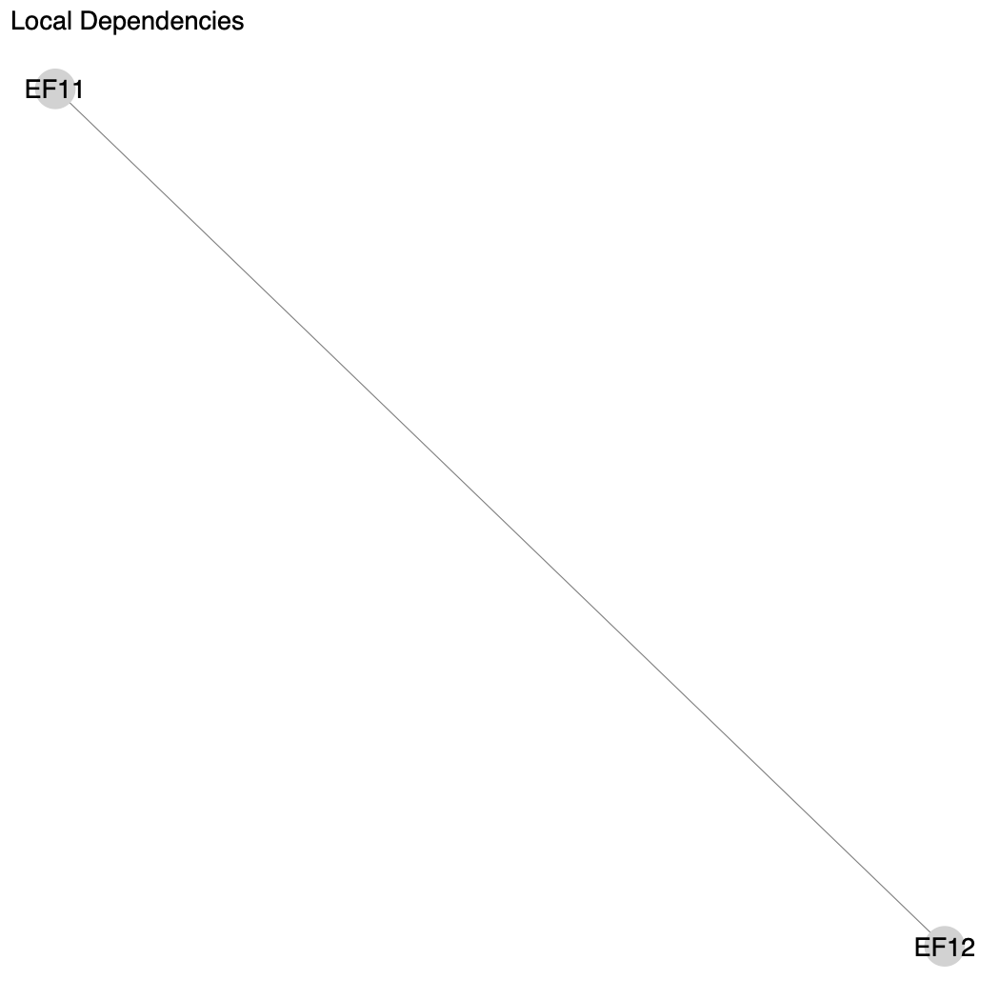
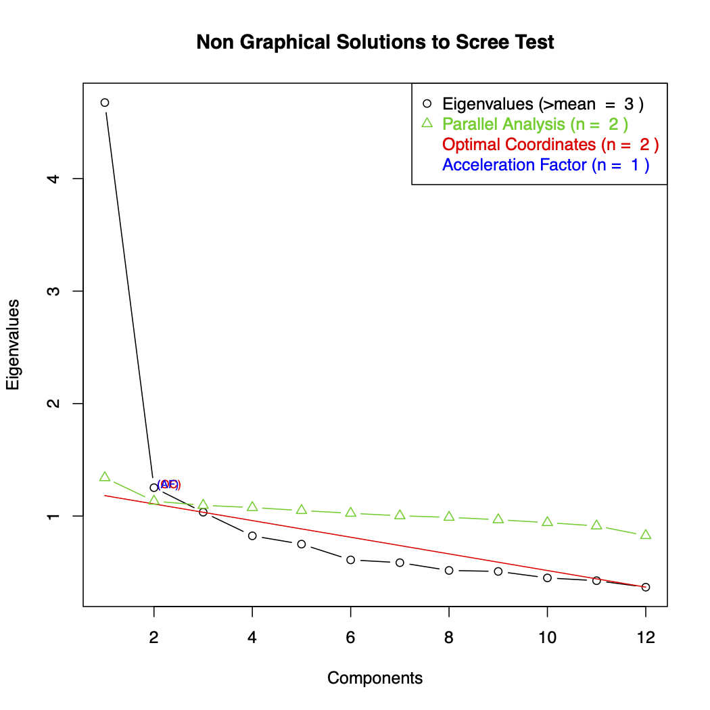
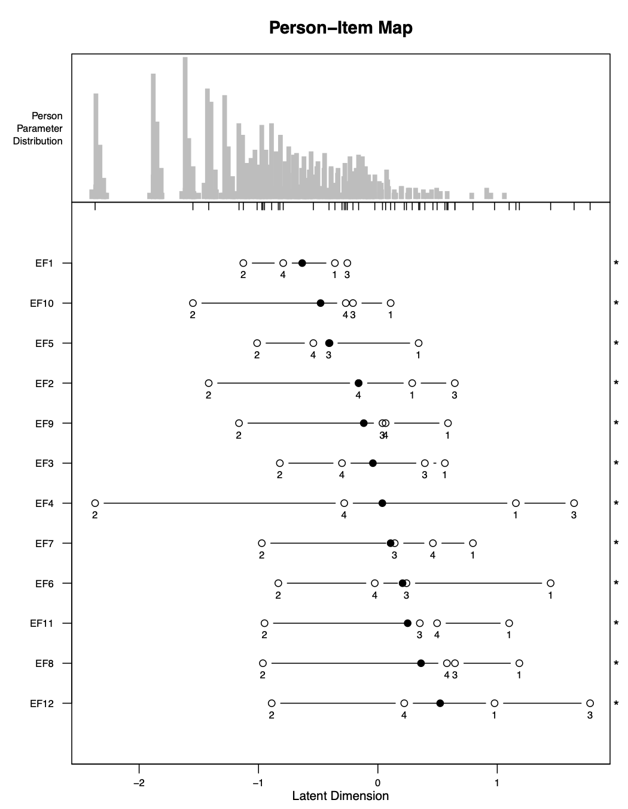
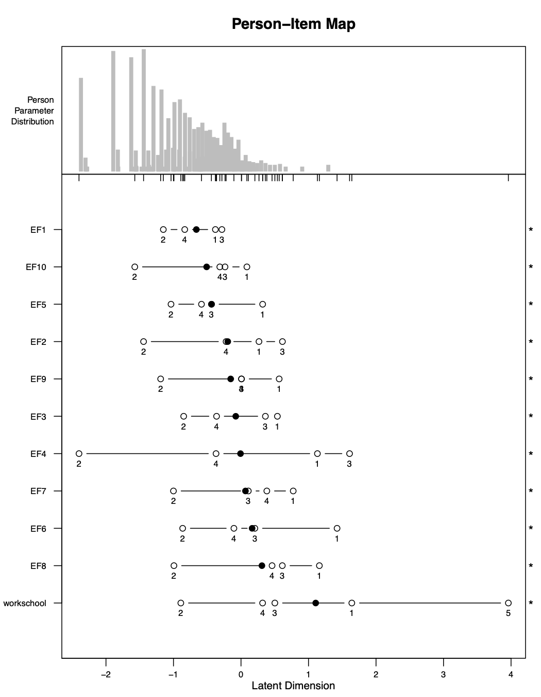
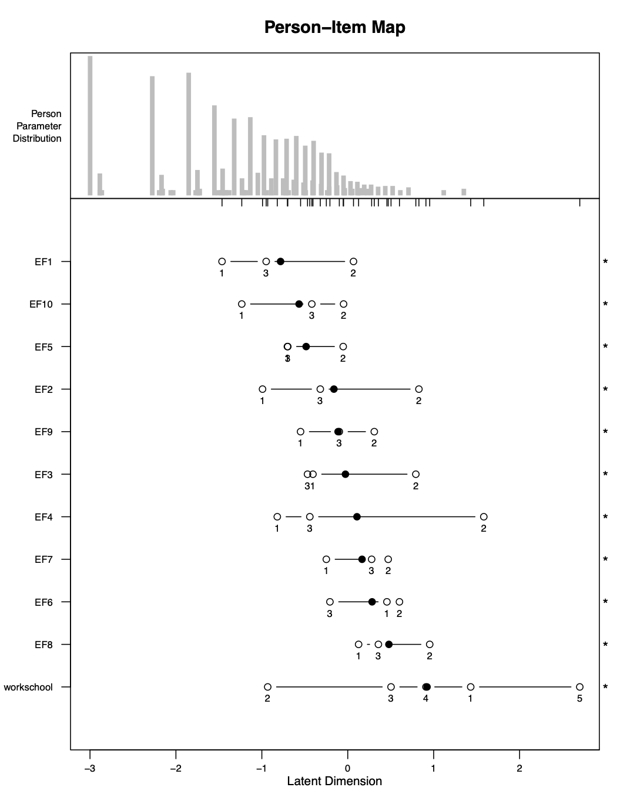
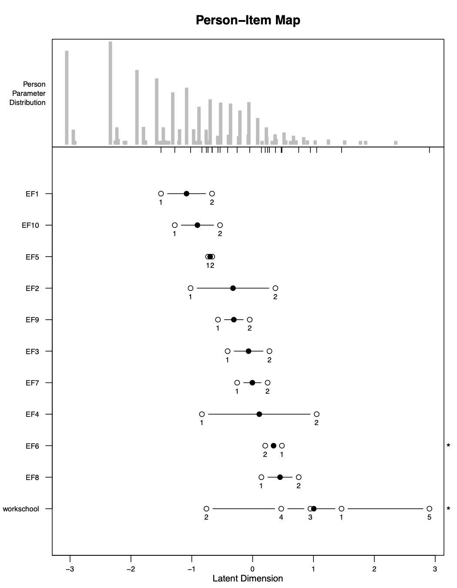

```{r setup, include=FALSE}
library(knitr)

opts_chunk$set(warning=FALSE, 
               message=FALSE, 
               eval=FALSE, 
               out.width = "80%",
               fig.align = "center",
               collapse = TRUE,
               comment = "#>")

```

# Structure

To perform Rasch Analysis for adults, only one function needs to be used: `rasch_mds()`. This is referred to as a "wrapper function." A wrapper function is a function that makes it easier to use other functions. In our case, `rasch_mds()` utilizes all the other `rasch_*()` functions to perform the analysis. These other `rasch_*()` functions used for adults are: 

* `rasch_DIF()`
* `rasch_drop()`
* `rasch_factor()`
* `rasch_model()`
* `rasch_rawscore()`
* `rasch_recode()`
* `rasch_rescale()`
* `rasch_split()`
* `rasch_testlet()`

You only need to use the function `rasch_mds()`. But if you wanted to perform your analysis in a more customized way, you could work with the internal functions directly.


# Output

After each iteration of the Rasch Model, the codes above produce a variety of files that will tell you how well the data fit the assumptions of the model at this iteration. The most important files are the ones below. We will explain each in detail through our example.

* `LID_plot.pdf` - shows correlated items
* `LID_above_0.2.csv` - correlations between correlated items
* `parallel_analysis_scree.pdf` - scree plot
* `bifactor_analysis.pdf` - loadings of factors
* `PImap.pdf`- locations of persons and items, ordering of thresholds
* `item_fit.csv` - item fit
* `Targeting.csv` - reliability of model


# Arguments of `rasch_mds()`

In this section we will examine each argument of the function `rasch_mds()`. The help file for the function also describes the arguments. Help files for functions in `R` can be accessed by writing `?` before the function name, like so:

```{r rasch-mds-help}
?rasch_mds
```

Below is an example of a use of the function `rasch_mds()`:

```{r rasch-mds-example}
rasch_mds(
  df = df_adults, 
  vars_metric = paste0("EF", 1:12),
  vars_id = "HHID", 
  vars_DIF = c("sex", "age_cat"),
  resp_opts = 1:5, 
  max_NA = 2,
  print_results = TRUE,
  path_parent = "/Users/lindsaylee/Desktop/",
  model_name = "Start",
  testlet_strategy = NULL,
  recode_strategy = NULL,
  drop_vars = NULL,
  split_strategy = NULL,
  comment = "Initial run"
)
```

The first argument is `df`. This argument is for the data. The data object should be individual survey data, with one row per individual. Here the data is stored in an object `df_adults`, which is a dataset included in the `whomds` package. To find out more about `df_adults` please look at its help file by running: `?df_adults`

The second argument is `vars_metric`, which is equal to a character vector of the column names for the items to use in Rasch Analysis. Here it is equal to `paste0("EF", 1:12)`, which is a character vector of length 12 of the column names `EF1`, `EF2`, ... `EF11`, and `EF12`.

The next argument is `vars_id`, which is the name of the column used to uniquely identify individuals. Here the ID column is called `HHID`. 

The next argument is `vars_DIF`. It is equal to a character vector with the names of the columns that are used to analyze differential item functioning (DIF). DIF will be discussed in more detail in later sections. Here `vars_DIF` is equal to a character vector of length two containing the name of the columns `"sex"` and `"age_cat"`.

The next argument is `resp_opts`. This is a numeric vector with the possible response options for `vars_metric`. In this survey, the questions `EF1` to `EF12` have response options 1 to 5. So here `resp_opts` is equal to a numeric vector of length 5 with the values `1`, `2`, `3`, `4` and `5`. 

The next argument is `max_NA`. This is a numeric value for the maximum number of missing values allowed for an individual to be still be considered in the analysis. Rasch Analysis can handle individuals having a few missing values, but too many will cause problems in the analysis. In general all individuals in the sample should have fewer than 15% missing values. Here `max_NA` is set to `2`, meaning individuals are allowed to have a maximum of two missing values out of the questions in `vars_metric` to still be included in the analysis.

The next argument is `print_results`, which is either `TRUE` or `FALSE`. When it is `TRUE`, files will be saved onto your computer with results from the Rasch iteration. When it is `FALSE`, files will not be saved.

The next argument is `path_parent`. This is a string with the path to the folder where the results of multiple models will be saved, assuming `print_results` is `TRUE`. The folder in `path_parent` will then contain separate folders with the names specified in `model_name` at each iteration. In the function call above, all results will be saved on the Desktop. Note that when writing paths for `R`, the slashes should all be: `/` (NOT `\`). Be sure to include a final `/` on the end of the path.

The next argument is `model_name`. This is equal to a string where you give a name of the model you are running. This name will be used as the name of the folder where all the output will be saved on your computer, if `print_results` is `TRUE`. The name you give should be short but informative. For example, you may call your first run "Start", as it is called here. If you create a testlet in your second run perhaps you can call it "Testlet1", etc. Choose whatever will be meaningful to you.

The next arguments are `testlet_strategy`, `recode_strategy`, `drop_vars` and `split_strategy`. These are arguments that control how the data is used in each iteration of the Rasch Model. Each will be discussed in more detail in later sections. Here they are all set to `NULL`, which means they are not used in the iteration of Rasch Analysis shown here.

The last argument is `comment`. This is equal to a string where you can write some free-text information about the current iteration so that when you are looking at the results later you can remember what you did and why you did it. It is better to be more detailed, because you will forget why you chose to run the model in this particular way. This comment will be saved in a file `Comment.txt`. Here the comment is just `"Initial run"`. 

# Adjusting the data

Next, we will discuss the arguments that give instructions about how to adjust the data. These parts may not be entirely meaningful now, but will become more so after we go through an example.

## Making testlets

If you want to create testlets--that is, sum up items into super items in order to fix item dependence--then pass a strategy for making testlets to the argument `testlet_strategy`. `testlet_strategy` is a list with one element of the list per testlet that you want to create. Each element of the list must be a character vector of column names to use for the testlet. Optionally, you can name the elements of the list to give custom names to the new testlets. Otherwise, the new testlets will be the original column names separated by "_". 

For example, imagine you wanted to make two testlets: one testlet from variables `EF4`, `EF6`, and `EF8` with a new name of `new`, and another testlet from `EF5` and `EF7`, without a new name specified. Then you would specify `testlet_strategy` as the following:

```{r rasch-mds-testlet}
rasch_mds(
  ..., 
  testlet_strategy = list(
    new = c("EF4", "EF6", "EF8"),
    c("EF5", "EF7")
  )
)
```


## Recoding

If you want to recode response options--that is, change response options in order to create stochastic ordering--then pass a strategy for the recoding to the argument `recode_strategy`. `recode_strategy` takes the form of a named list, with one element of the list per recode strategy. The names of the list are the groups of column names to use for each recoding strategy, separated only by ",". Each element of the list is a numeric vector giving the new response options to map the variables to. 

For example, if you wanted to collapse the last two response options of the variables `EF1` and `EF2`, and collapse the first two response options of `EF3`, then you would set `recode_strategy` as the following:

```{r rasch-mds-recode}
rasch_mds(
  ..., 
  recode_strategy = list(
    "EF1,EF2" = c(0,1,2,3,3),
    "EF3" = c(0,0,1,2,3)
  )
)
```


## Dropping variables

If you want to drop any items from your analysis--perhaps in the event of extremely poor fit--then set `drop_vars` as a character vector of the column names to drop from the analysis. 

For example, if the items `EF4` and `EF7` were extremely poorly fitting items, then they could be dropped from the analysis by setting `drop_vars` as the following:

```{r rasch-mds-drop}
rasch_mds(
  ..., 
  drop_vars = c("EF4", "EF7")
)
```

## Splitting

If you want to split items by subgroups--perhaps in the event of high differential item functioning (DIF)--then you give the instructions for your split strategy in the argument `split_strategy`. 

Splitting items entails taking a single item and separating it into two or more items for different groups. For example, if we wanted to split an item  `var` by sex, then we would create two items: `var_Male` and `var_Female`. `var_Male` would be equivalent to `var` for all respondents that are men, and `NA` for the respondents that are women. `var_Female` would be equivalent to `var` for all respondents that are women, and `NA` for the respondents that are men.

`split_strategy` takes the form of a named list. There is one element of the list per variable to split by. Each element of the list must be a character vector of column names to split. The names of the list are the variables to split each group of variables by. 

For example, if we wanted to split the variables `EF1` and `EF2` by `sex`, and split `EF3` by age category `age_cat`, then we would set `split_strategy` to be the following:

```{r rasch-mds-split}
rasch_mds(
  ..., 
  split_strategy = list(
    sex = c("EF1", "EF2"),
    age_cat = c("EF3")
  )
)
```

However, because we expect a certain amount of DIF when measuring disability--especially by sex and age--we rarely use this option. To not perform any splitting, leave `split_strategy` as its default value of `NULL.`


# Example 

Below we will be creating a metric using the sample data `df_adults` using the environmental factors (EF) questions from the questionnaire. These are questions `EF1` to `EF12`.

## Start

We will start by trying to run the model without performing any adjustments on our data. To run this model, run a command that is similar to this:

```{r adult-start-example}
start <- rasch_mds(
  df = df_adults, 
  vars_metric = paste0("EF", 1:12),
  vars_id = "HHID", 
  vars_DIF = c("sex", "age_cat"),
  resp_opts = 1:5, 
  max_NA = 2,
  print_results = TRUE,
  path_parent = "/Users/lindsaylee/Desktop/",
  model_name = "Start",
  testlet_strategy = NULL,
  recode_strategy = NULL,
  drop_vars = NULL,
  split_strategy = NULL,
  comment = "Initial run"
)
```

The code you run may not be exactly the same, because for instance the directory you use for `path_parent` will be specific to your machine, and you may choose a different `model_name` and `comment` for your model.

By running this command, in addition to printing results to your machine (because `print_results` is `TRUE`), you are also saving some output to an object in `R`'s global environment called `start`. This object is a list with three elements: one named `df`, one named `vars_metric`, and one named `df_results`. `df` contains the data with the transformed variables used to create the score and the rescaled scores. `vars_metric` is a character vector of the names of the `vars_metric` after transforming the variables. `df_results` is a data frame with one row and a column for each of the main statistics for assessing the assumptions of the Rasch Model. `df_results` from multiple models can be merged in order to create a data frame that allows you to quickly compare different models. 

It is not necessary to save the output of `rasch_mds()` to an object in the global environment, but it makes it easier to manipulate the resulting output in order to determine what adjustments to make to your data in the next iteration.

After running this command, various files will be saved to the folder that you specified. Go to the `path_parent` folder, and you will see a new folder with the name you specified in `model_name`. Inside that folder, there will be many files. We will focus on the most important ones. Please read again Section \@ref(repair) to review how the different Rasch Model assumptions affect one another and to understand why we will check the important files in this particular order.

First we will check the local item dependence of the items. We can check this by looking at the files `LID_plot.pdf` and `LID_above_0.2.csv`. `LID_above_0.2.csv` gives the correlations of the residuals that are above 0.2, and `LID_plot.pdf` is a visualization of these correlations. From these files, we can see that the items `EF11` and `EF12` are correlated. The value of the correlation is approximately 0.47. These two items have to do with how facilitating or hindering work (`EF11`) and school (`EF12`) are. Conceptually, it makes sense that people's answers to these two questions are related. We will take care of this correlation at the next iteration of the model.

```{r adult-start-LID, echo=FALSE, eval=TRUE}

```


Next we will investigate the unidimensionality of the model by analyzing the file `parallel_analysis_scree.pdf`. This is what's known as a "scree plot." A scree plot shows the eigenvalues for our model, and indicates how many underlying dimensions we have in our questionnaire. With this scree plot, we hope to see a very sharp decline after the first eigenvalue on the left, and that the second eigenvalue falls below the green line of the "Parallel Analysis". This would mean that we have one underlying dimensions that is very strong in our data, and any further dimensions that are computed have very little influence on the model. In our graph, we do see a very sharp decline after the first eigenvalue, and the green line crosses the black line after the second factor. This is sufficient to confirm unidimensionality for the model. 

```{r adult-start-scree, echo=FALSE, eval=TRUE}

```

Another important file we can examine is the `PImap.pdf`. This is the "Person-Item Map", and it shows people and items on the same continuum. The horizontal axis on the bottom of the figure is this continuum, labeled as the "latent dimension". The top of the figure is labeled the "person parameter distribution". This is the distribution of people's scores on the continuum. It can show you if, for instance, you have more people on one end of the scale or another. 

```{r adult-start-PI, echo=FALSE, eval=TRUE}

```

The largest part of this figure shows where the thresholds for each item are located on the continuum. The thresholds are labeled with numbers: the first threshold is labeled "1", the second is labeled "2", and so on. The black dot is the average of the locations of all these thresholds. The stars on the right side of the figure indicate whether or not the thresholds are out of order. For instance, you can see for `EF1`, the thresholds are ordered 2, 4, 1, 3 which is clearly out of order. In fact, in this case, all of the items have thresholds out of order. This is likely something we will need to take care of later, but first we will take care of the item dependence.

Another important file we can analyze is `item_fit.csv`. This file gives the fit statistics for each item. Two fit statistics used here are "outfit" and "infit", given in the columns `i.outfitMSQ` and `i.infitMSQ`. They are both similar, but outfit is more sensitive to outliers. In general we hope that these figures are as close to 1 as possible. If they are below 1, then it indicates the item is overfitting. "Overfit" refers to the situation when items fit "too closely" to the model. If these statistics are greater than 1, then they indicate the items are underfitting. "Underfit" refers to the situation when items do not fit the model well. Underfitting is more serious than overfitting. We hope in general that items' infit and outfit are between 0.5 and 1.5. If they are less than 0.5, reliability measures for the model may be misleadingly high, but the scores can still be used. If they are between 1.5 and 2.0, this is a warning sign that the items may be causing problems and you could begin to consider adjusting the data to improve the fit. If they are greater than 2.0, the scores calculated may be significantly distorted and action should be taken to adjust the data to improve fit.

In this case, all of the items have infit and outfit statistics between 0.5 and 1.5, which is good.

To analyze overall model fit, we can open the file `Targeting.csv`. This file gives the mean and standard deviation of the person abilities and of the item difficulties. It also gives the "person separation index", or PSI, which is a measure of reliability for the model. We hope this value is as close to 1 as possible. It is generally acceptable if it is this figure is above 0.7, though we hope to get values as high as 0.8 or 0.9. For our model here, our PSI is 0.82, which is very good.

## Testlet1

With our next iteration of the model, we will try to address the high item dependence between items `EF11` and `EF12`. We will do this by creating a testlet between these two items. We do this by changing the argument `testlet_stratey` as shown below. We have given the new testlet the name `workschool`, but you could name it whatever you wished. 


```{r adult-t1-example}
testlet1 <- rasch_mds(
  df = df_adults, 
  vars_metric = paste0("EF", 1:12),
  vars_id = "HHID", 
  vars_DIF = c("sex", "age_cat"),
  resp_opts = 1:5, 
  max_NA = 2,
  print_results = TRUE,
  path_parent = "/Users/lindsaylee/Desktop/",
  model_name = "Testlet1",
  testlet_strategy = list(workschool = c("EF11", "EF12")),
  recode_strategy = NULL,
  drop_vars = NULL,
  split_strategy = NULL,
  comment = "Testlet: EF11,EF12 (LID>0.25)"
)
```

After running this model, we get an error:

```{r adult-t1-error, echo=FALSE, eval=TRUE, message=TRUE}
 message("Error in tapply(1L:ncol(X01beta), mt_ind, function(xin) { :
      arguments must have same length ")
```

This error is a bit strange looking. But sometimes errors like this will arise because of too many NAs in the data or if there are not enough people endorsing all possible response options. Let's look at the file `response_freq.csv` in order to see how the response options are distributed. We can see in this file that there are many endorsements for all response options for all questions except for our new testlet `workschool`, which only has 1 person with an answer of 6, and no one with the possible answers of 5, 7 or 8. Perhaps this is what is causing the problem.

### More on recoding

First let's discuss recoding in a bit more detail.

Each question with `n` response options will have `n-1` thresholds. The first threshold (labeled with a "1" in the person-item map) is the point between the first and second response option where a respondent is equally likely to choose either of these response options; the second threshold (labeled with a "2" in the person-item map) is the point between the second and third response option where a respondent is equally likely to choose either of these response options; and so on. 

We want our thresholds in the person-item map to be in the right order: 1, 2, 3, 4 and so on. Disordered thresholds indicate a problem with our items. For example, if the thresholds are listed in the order 1, 2, 4, 3, then the data are telling us that someone is more likely to surpass the 4th threshold before the 3rd threshold, which does not make sense. We recode the response options in order create fewer thresholds so that it is easier for them to be in order. 

The functions to perform Rasch Analysis shift our response options so that they start with 0. This is done because the functions for performing the analysis require it. For example, our survey has questions that have response options ranging from 1 to 5, but internally the function shifts these response options so they range from 0 to 4. Consequently, it becomes slightly more straightforward to interpret which response options need to be recoded directly from the labels of the thresholds. For example, if an item is disordered in the pattern 1, 2, 4, 3, this means that thresholds 4 and 3 are out of order. This also means that we can recode the transformed response options 4 and 3 in order to collapse these thresholds.

When we want to recode an item, we supply the function with instructions on what to map the response options to. For example, let's say an item `var` has disordered thresholds in the pattern 1, 2, 4, 3. We now want to collapse the 4th and the 3rd threshold so that the item becomes ordered. `var` has response options ranging from 0 to 4 (after being shifted from the original 1 to 5), so we want to combine the response options 3 and 4 for the item in order to collapse these two thresholds. We do this by telling the function to map the current response options of 0, 1, 2, 3, 4 to 0, 1, 2, 3, 3. This means all responses of "4" are now recoded to be "3". Now we will only have 4 different response options, which means we will have 3 different thresholds, which will now hopefully be in the proper order.

This will become clearer as we work through the example.

## Testlet1_Recode1

At the next iteration, we will try to recode the response options of our testlet so that the model is able to run. 

We will run the command like below:

```{r adult-t1r1-example}
testlet1_recode1 <- rasch_mds(
  df = df_adults, 
  vars_metric = paste0("EF", 1:12),
  vars_id = "HHID", 
  vars_DIF = c("sex", "age_cat"),
  resp_opts = 1:5, 
  max_NA = 2,
  print_results = TRUE,
  path_parent = "/Users/lindsaylee/Desktop/",
  model_name = "Testlet1_Recode1",
  testlet_strategy = list(workschool = c("EF11", "EF12")),
  recode_strategy = list(workschool = c(0,1,2,3,4,5,5,5,5)),
  drop_vars = NULL,
  split_strategy = NULL,
  comment = "Testlet: EF11,EF12 (LID>0.25); Recode: workschool to 0,1,2,3,4,5,5,5,5"
)
```

The difference between the Testlet1 model and this model is that we have now added a recoding strategy. We will recode the response options of the testlet `workschool` to 0,1,2,3,4,5,5,5,5. This means all response options will stay the same, except the response options 5 through 8 are combined.

After we run the command, we see the model is able to be calculated as normal.

First we check `LID_plot.pdf` to see if we have been able to remove the item correlation. In this file, we see the message "No LID found", which means our testlet strategy was effective!

Next, we check the scree plot in the file `parallel_analysis_scree.pdf` to make sure our unidimensionality was maintained. Indeed, it looks very similar to the initial model, which is what we hope for.

Next we check the person-item map in `PImap.pdf`. We can see in this file all the items are still disordered, so this is likely the next thing we will have to take care of in the next iteration of the model.

```{r adult-t1r1-PI, echo=FALSE, eval=TRUE}

```

We finally will check the item fit and the overall model fit in `item_fit.csv` and `Targeting.csv`, respectively. We can see these values are all still good--every item still has infit and outfit statistics between 0.5 and 1.5, and the PSI is still 0.82.

## Testlet1_Recode2

Next we will try recoding items in order to create ordered thresholds. We are most worried about having the single items (everything that is not a testlet) ordered.

There are various ways you can choose the recoding strategy. In general you want to do the minimum amount of recoding necessary to acheive ordered thresholds. We will try first to collapse the first two thresholds for all items that are not the testlet. We will see which items this works for, and try a new strategy at the next iteration for the items where it did not work.

```{r adult-t1r2-example}
testlet1_recode2 <- rasch_mds(
  df = df_adults, 
  vars_metric = paste0("EF", 1:12),
  vars_id = "HHID", 
  vars_DIF = c("sex", "age_cat"),
  resp_opts = 1:5, 
  max_NA = 2,
  print_results = TRUE,
  path_parent = "/Users/lindsaylee/Desktop/",
  model_name = "Testlet1_Recode2",
  testlet_strategy = list(workschool = c("EF11", "EF12")),
  recode_strategy = list(workschool = c(0,1,2,3,4,5,5,5,5),
                         "EF1,EF2,EF3,EF4,EF5,EF6,EF7,EF8,EF9,EF10" = c(0,1,1,2,3)),
  drop_vars = NULL,
  split_strategy = NULL,
  comment = "Testlet: EF11,EF12 (LID>0.25); Recode: workschool to 0,1,2,3,4,5,5,5,5, everything else 0,1,1,2,3"
)
```


We can see in the new person-item map that this strategy did not work for any of the items. So we will try a new strategy at the next iteration.

```{r adult-t1r2-PI, echo=FALSE, eval=TRUE}

```

We can also check the other files to see if any other Rasch Model assumptions have now been violated with this recoding strategy. But because we are changing our strategy completely at the next iteration, it is not necessary to pay too much attention to the other files for this iteration.


## Testlet1_Recode3

From the person-item map for the Start model, we can see our items are disordered in a bit of a complicated way: many items have thresholds in order 2, 4, 1, 3 or in order 2, 3, 4, 1. Usually if an item has disordered thresholds in a fairly uncomplicated pattern (for example, 1, 2, 4, 3 or 2, 1, 3, 4) then then the recoding strategy is straightforward. For example, with disordering of 1, 2, 4, 3 it is clear that the respone options 3 and 4 should be collapsed. With disordering of 2, 1, 3, 4 then the response options of 1 and 2 should be collapsed.

In our case, the disordering is fairly complicated so the recoding strategy is less straightforward and will likely have to be more extreme. At this iteration, we will try collapsing two sets of response options: we will collapse 1 with 2 and 3 with 4, as shown below.

```{r adult-t1r3-example}
testlet1_recode3 <- rasch_mds(
  df = df_adults, 
  vars_metric = paste0("EF", 1:12),
  vars_id = "HHID", 
  vars_DIF = c("sex", "age_cat"),
  resp_opts = 1:5, 
  max_NA = 2,
  print_results = TRUE,
  path_parent = "/Users/lindsaylee/Desktop/",
  model_name = "Testlet1_Recode3",
  testlet_strategy = list(workschool = c("EF11", "EF12")),
  recode_strategy = list(workschool = c(0,1,2,3,4,5,5,5,5),
                         "EF1,EF2,EF3,EF4,EF5,EF6,EF7,EF8,EF9,EF10" = c(0,1,1,2,2)),
  drop_vars = NULL,
  split_strategy = NULL,
  comment = "Testlet: EF11,EF12 (LID>0.25); Recode: workschool to 0,1,2,3,4,5,5,5,5, everything else 0,1,1,2,2"
)
```

We can see with this recoding strategy that the thresholds are now ordered for most of the items! The only item it did not work for is `EF6`, which we will have to try a different strategy for at the next iteration.

```{r adult-t1r3-PI, echo=FALSE, eval=TRUE}

```

We made progress on our threshold disordering, but we need to make sure that the other Rasch Model assumptions have not now been violated with this new strategy. We check `LID_plot.pdf` and see we still have achieved item independence. We also check the scree plot in `parallel_analysis_scree.pdf` to see if we still have unidimensionality. Finally, we also check `item_fit.csv` and `Targeting.csv` and see that the values are still acceptable in these files as well. So we will proceed with an altered recoding strategy in the next iteration.


## Testlet1_Recode4

We still have two items that are disordered: `EF6` and `workschool`. We do not generally worry about testlets being disordered because they are not items originally included in the questionnaire. We could recode `workschool` if its item fit was very poor, but in our model it maintains good item fit based on the infit and outfit statistics, so we will not recode it. 

Therefore at this iteration we will just try to solve the disordering of `EF6`. We will try collapsing the middle three response options, as shown below.

```{r adult-t1r4-example}
testlet1_recode4 <- rasch_mds(
  df = df_adults, 
  vars_metric = paste0("EF", 1:12),
  vars_id = "HHID", 
  vars_DIF = c("sex", "age_cat"),
  resp_opts = 1:5, 
  max_NA = 2,
  print_results = TRUE,
  path_parent = "/Users/lindsaylee/Desktop/",
  model_name = "Testlet1_Recode4",
  testlet_strategy = list(workschool = c("EF11", "EF12")),
  recode_strategy = list(workschool = c(0,1,2,3,4,5,5,5,5),
                         "EF1,EF2,EF3,EF4,EF5,EF7,EF8,EF9,EF10" = c(0,1,1,2,2),
                         EF6 = c(0,1,1,1,2)),
  drop_vars = NULL,
  split_strategy = NULL,
  comment = "Testlet: EF11,EF12 (LID>0.25); Recode: workschool to 0,1,2,3,4,5,5,5,5, everything else except EF6 to 0,1,1,2,2, EF6 to 0,1,1,1,2"
)
```

After running this model, we see the disordering for `EF6` has been resolved! All single items now have ordered thresholds!

```{r adult-t1r4-PI, echo=FALSE, eval=TRUE}

```


We will also check the other files to make sure our other Rasch Model assumptions have been maintained.  We check `LID_plot.pdf` and see we still have achieved item independence. We also check the scree plot in `parallel_analysis_scree.pdf` to see if we still have unidimensionality. Finally, we also check `item_fit.csv` and `Targeting.csv` and see that the values are still acceptable in these files as well.

All of our Rasch Model assumptions have been reasonably attained, so this means we can stop! We have finished our Rasch Analysis for this set of questions. The data with the scores is in the file `Data_final.csv`. We will discuss what to do with these scores in later sections.

# Best practices

Go to the [Best Practices in Rasch Analysis](c5_best_practices_EN.html) vignette to read more about general rules to follow.
