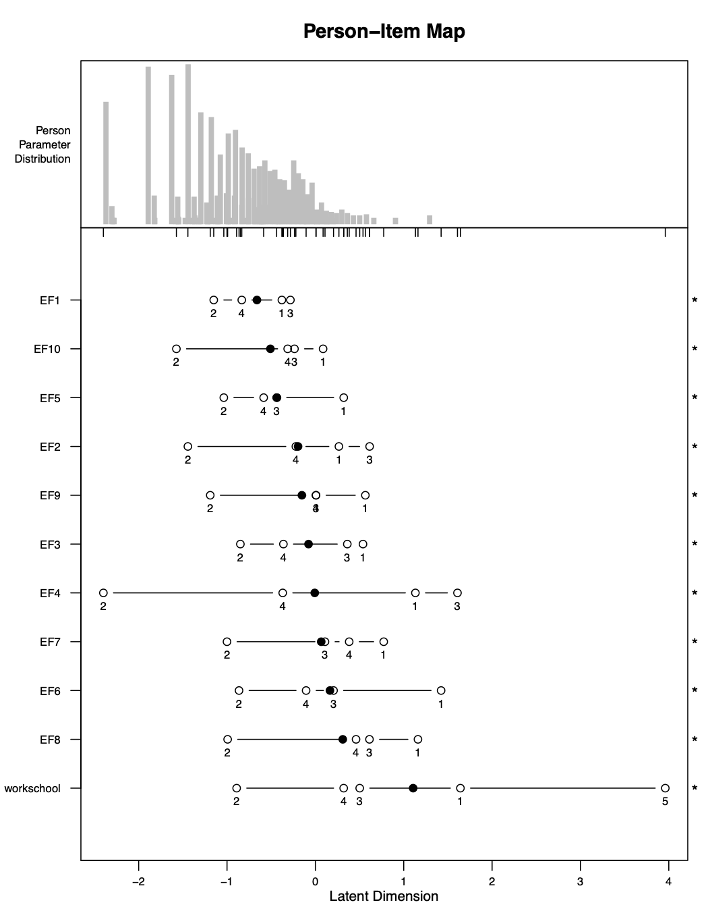
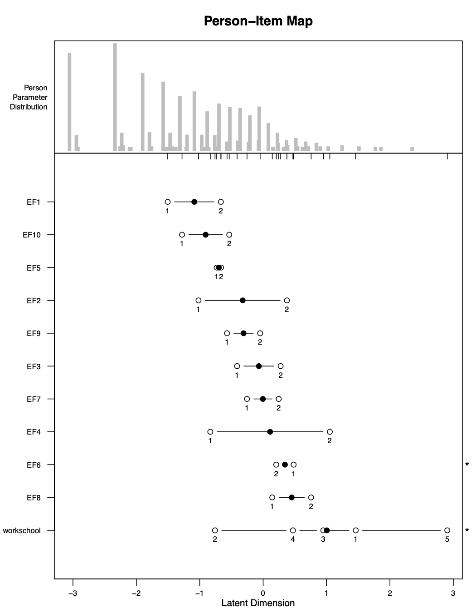

```{r setup, include=FALSE}
library(knitr)

opts_chunk$set(warning=FALSE, 
               message=FALSE, 
               eval=FALSE, 
               out.width = "80%",
               fig.align = "center",
               collapse = TRUE,
               comment = "#>")

```

# Estructura

Para realizar el Análisis Rasch para adultos, solo se necesita usar una función: `rasch_mds()`. Esto se conoce como una "función de envoltura" (_wrapper function_). Una función de envoltura es una función que facilita el uso de otras funciones. En nuestro caso, `rasch_mds()` utiliza todas las otras funciones `rasch_*()` para realizar el análisis. Estas otras funciones `rasch_*()` usadas para adultos son:

* `rasch_DIF()`
* `rasch_drop()`
* `rasch_factor()`
* `rasch_model()`
* `rasch_rawscore()`
* `rasch_recode()`
* `rasch_rescale()`
* `rasch_split()`
* `rasch_testlet()`

Solo necesitas usar la función `rasch_mds()`. Pero si desea realizar su análisis de una manera más personalizada, puede trabajar directamente con las funciones internas.


# Salida

Después de cada iteración del Modelo Rasch, los códigos anteriores producen una variedad de archivos que le dirán qué tan bien los datos se ajustan a las suposiciones del modelo en esta iteración. Los archivos más importantes son los de abajo. Explicaremos cada uno en detalle a través de nuestro ejemplo.

* `LID_plot.pdf` - muestra elementos correlacionados
* `LID_above_0.2.csv` - correlaciones entre elementos correlacionados
* `parallel_analysis_scree.pdf` - gráfico de scree
* `bifactor_analysis.pdf` - cargas de factores
* `PImap.pdf`- ubicaciones de personas y ítems, ordenamiento de umbrales
* `item_fit.xlsx` - ajuste de ítems
* `Targetting.csv` - fiabilidad del modelo


# Argumentos de `rasch_mds()`

En esta sección examinaremos cada argumento de la función `rasch_mds()`. El archivo de ayuda para la función también describe los argumentos. Se puede acceder a los archivos de ayuda para las funciones en `R` escribiendo `?` antes del nombre de la función, de esta manera:

```{r rasch-mds-help}
?rasch_mds
```

A continuación se muestra un ejemplo de uso de la función `rasch_mds()`:

```{r rasch-mds-example}
rasch_mds(
  df = df_adults, 
  vars_metric = paste0("EF", 1:12),
  vars_id = "HHID", 
  vars_DIF = c("sex", "age_cat"),
  resp_opts = 1:5, 
  max_NA = 2,
  print_results = TRUE,
  path_parent = "/Users/lindsaylee/Desktop/",
  model_name = "Start",
  testlet_strategy = NULL,
  recode_strategy = NULL,
  drop_vars = NULL,
  split_strategy = NULL,
  comment = "Initial run"
)
```

El primer argumento es `df`. Este argumento es para los datos. El objeto de datos debe ser datos de encuestas individuales, con una fila por persona. Aquí los datos se almacenan en un objeto `df_adults`, que es un base de datos incluido en el paquete` whomds`. Para obtener más información sobre `df_adults`, consulta su archivo de ayuda ejecutando:`?df_adults`

El segundo argumento es `vars_metric`, que es igual a un vector de caracteres de los nombres de columna para los elementos a usar en el Análisis de Rasch. Aquí es igual a `paste0("EF", 1:12)`, que es un vector de caracteres de longitud 12 de los nombres de columna `EF1`, `EF2`, ... `EF11` y `EF12`.

El siguiente argumento es `vars_id`, que es el nombre de la columna utilizada para identificar de forma única a los individuos. Aquí la columna de ID se llama `HHID`.

El siguiente argumento es `vars_DIF`. Es igual a un vector de caracteres con los nombres de las columnas que se utilizan para analizar el funcionamiento diferencial de elementos (DIF). DIF se tratará con más detalle en las secciones posteriores. Aquí `vars_DIF` es igual a un vector de caracteres de longitud dos que contiene el nombre de las columnas `"sex"` y `"age_cat"`.

El siguiente argumento es `resp_opts`. Este es un vector numérico con las posibles opciones de respuesta para `vars_metric`. En esta encuesta, las preguntas `EF1` a `EF12` tienen las opciones de respuesta 1 a 5. Entonces, `resp_opts` es igual a un vector numérico de longitud 5 con los valores `1`, `2`,` 3`, `4` y `5`.

El siguiente argumento es `max_NA`. Este es un valor numérico para el número máximo de valores faltantes permitidos para que una persona aún se tenga en cuenta en el análisis. El Análisis de Rasch puede manejar a personas que tienen algunos valores faltantes, pero demasiados causarán problemas en el análisis. En general, todos los individuos en la muestra deben tener menos del 15% de valores faltantes. Aquí `max_NA` es `2`, lo que significa que se permite que los individuos tengan un máximo de dos valores faltantes de las preguntas en `vars_metric` para que aún se incluyan en el análisis.

El siguiente argumento es `print_results`, que es `TRUE` o `FALSE`. Cuando es `TRUE`, los archivos se guardarán en su computadora con los resultados de la iteración Rasch. Cuando es `FALSE`, los archivos no se guardarán.

El siguiente argumento es `path_parent`. Esta es una cadena con la ruta a la carpeta donde se guardarán los resultados de múltiples modelos, asumiendo que `print_results` es `TRUE`. La carpeta en `path_parent` contendrá carpetas separadas con los nombres especificados en `model_name` en cada iteración. En la ejecución de la función anterior, todos los resultados se guardarán en el Desktop. Ten en cuenta que al escribir rutas para `R`, todas las barras deberían ser: `/ `(NO `\`). Asegúrate de incluir un `/` final en el final de la ruta.

El siguiente argumento es `model_name`. Esto es igual a una cadena donde le das un nombre del modelo que estás ejecutando. Este nombre se usará como el nombre de la carpeta donde se guardará toda la salida en su computadora, si `print_results` es `TRUE`. El nombre que le des debe ser corto pero informativo. Por ejemplo, puede llamar a su primera ejecución "Start", como se llama aquí. Si creas un testlet en su segunda ejecución, quizás puedas llamarlo "Testlet1", etc. Elije lo que sea significativo para tí.

Los siguientes argumentos son `testlet_strategy`, `recode_strategy`, `drop_vars` y `split_strategy`. Estos son argumentos que controlan cómo se usan los datos en cada iteración del Modelo Rasch. Cada uno será discutido con más detalle en secciones posteriores. Aquí están todos configurados en `NULL`, lo que significa que no se usan en la iteración del Análisis Rasch que se muestra aquí.

El último argumento es `comment`. Esto es igual a una cadena en la que puedes escribir cierta información de texto libre sobre la iteración actual para que cuando veas los resultados más adelante puedas recordar lo que hiciste y por qué lo hiciste. Es mejor ser más detallado, porque olvidarás por qué eligiste ejecutar el modelo de esta manera en particular. Este comentario se guardará en un archivo `Comment.txt`. Aquí el comentario es solo `"Initial run"`.

# Ajustar los datos

A continuación, discutiremos los argumentos que dan instrucciones sobre cómo ajustar los datos. Es posible que estas partes no sean del todo significativas ahora, pero lo serán aún más después de que pasemos por un ejemplo.

## Crear testlets

Si deseas crear testlets, es decir, sumar los ítems en súper-ítems para corregir la dependencia de los ítems, luego pasa una estrategia para hacer testlets al argumento `testlet_strategy`. `testlet_strategy` es una lista con un elemento de la lista por testlet que deseas crear. Cada elemento de la lista debe ser un vector de caracteres de los nombres de columna para usar para el testlet. Opcionalmente, puede nombrar los elementos de la lista para dar nombres personalizados a los nuevos testlets. Sin nombres especificados, los nuevos testlets serán los nombres de columna originales separados por "_".

Por ejemplo, imagine que desea hacer dos testlets: un testlet de las variables `EF4`, `EF6` y `EF8` con un nuevo nombre de `new`, y otro testlet de `EF5` y `EF7`, sin un nuevo nombre especificado. Entonces deberías especificar `testlet_strategy` como lo siguiente:

```{r rasch-mds-testlet}
rasch_mds(
  ..., 
  testlet_strategy = list(
    new = c("EF4", "EF6", "EF8"),
    c("EF5", "EF7")
  )
)
```


## Recodificación

Si deseas recodificar las opciones de respuesta, es decir, cambiar las opciones de respuesta para crear un ordenamiento estocástico, entonces pasa una estrategia para la recodificación al argumento `recode_strategy`. `recode_strategy` toma la forma de una lista nombrada, con un elemento de la lista por estrategia de recode. Los nombres de la lista son los grupos de nombres de columna que se deben usar para cada estrategia de recodificación, separados solo por ",". Cada elemento de la lista es un vector numérico que proporciona las nuevas opciones de respuesta para asignar las variables.

Por ejemplo, si desea combinar las dos últimas opciones de respuesta de las variables `EF1` y `EF2`, y combinar las dos primeras opciones de respuesta de `EF3`, entonces establecería `recode_strategy` como lo siguiente:

```{r rasch-mds-recode}
rasch_mds(
  ..., 
  recode_strategy = list(
    "EF1,EF2" = c(0,1,2,3,3),
    "EF3" = c(0,0,1,2,3)
  )
)
```


## Eliminar variables

Si deseas eliminar cualquier ítem de tu análisis, tal vez en el caso de un ajuste extremadamente deficiente, configura `drop_vars` como un vector de caracteres de los nombres de columna para que se eliminen del análisis.

Por ejemplo, si los ítems `EF4` y `EF7` eran ítems extremadamente mal ajustados, entonces podrían eliminarse del análisis especificando `drop_vars` como lo siguiente:

```{r rasch-mds-drop}
rasch_mds(
  ..., 
  drop_vars = c("EF4", "EF7")
)
```

## Dividir

Si deseas dividir los ítems por subgrupos, tal vez en el caso de funcionamiento diferencial de ítems (DIF) alto, a continuación, das las instrucciones para su estrategia de división en el argumento `split_strategy`.

La división de ítems implica tomar un solo ítem y separarlo en dos o más ítems para diferentes grupos. Por ejemplo, si quisiéramos dividir un ítem `var` por sexo, crearíamos dos ítems:` var_Male` y `var_Female`. `var_Male` sería equivalente a `var` para todos los encuestados que son hombres, y `NA` para los encuestados que son mujeres. `var_Female` sería equivalente a `var` para todos los encuestados que son mujeres, y `NA` para los encuestados que son hombres.

`split_strategy` toma la forma de una lista nombrada. Hay un elemento de la lista por variable para la que divides. Cada elemento de la lista debe ser un vector de caracteres de los nombres de columna para dividir. Los nombres de la lista son las variables para las que divides cada grupo de variables.

Por ejemplo, si quisiéramos dividir las variables `EF1` y `EF2` por `sex`, y dividir `EF3` por la categoría de edad `age_cat`, entonces especificaríamos `split_strategy` como la siguiente:

```{r rasch-mds-split}
rasch_mds(
  ..., 
  split_strategy = list(
    sex = c("EF1", "EF2"),
    age_cat = c("EF3")
  )
)
```

Sin embargo, debido a que esperamos una cierta cantidad de DIF al medir la discapacidad, especialmente por sexo y edad, rara vez usamos esta opción. Para no realizar ninguna división, deje `split_strategy` como su valor predeterminado de `NULL`.

# Ejemplo

A continuación, crearemos una métrica utilizando los datos de muestra `df_adults` utilizando las preguntas de factores ambientales (EF, por sus siglas en inglés) del cuestionario. Estas son las preguntas `EF1` a `EF12`.

## Start

Comenzaremos intentando ejecutar el modelo sin realizar ningún ajuste en nuestros datos. Para ejecutar este modelo, ejecuta un comando que sea similar a este:

```{r adult-start-example}
start <- rasch_mds(
  df = df_adults, 
  vars_metric = paste0("EF", 1:12),
  vars_id = "HHID", 
  vars_DIF = c("sex", "age_cat"),
  resp_opts = 1:5, 
  max_NA = 2,
  print_results = TRUE,
  path_parent = "/Users/lindsaylee/Desktop/",
  model_name = "Start",
  testlet_strategy = NULL,
  recode_strategy = NULL,
  drop_vars = NULL,
  split_strategy = NULL,
  comment = "Initial run"
)
```

Es posible que el código que ejecutas no sea exactamente el mismo, porque, por ejemplo, el directorio que usas para `path_parent` será específico para tu máquina, y puedes elegir un `model_name` y `comment` diferentes para tu modelo.

Al ejecutar este comando, se imprime los resultados en tu máquina (porque `print_results` es `TRUE`), también está guardando algo de salida en un objeto en el entorno global de `R` llamado `start`. Este objeto es una lista con tres elementos: uno llamado `df`, uno llamado `vars_metric` y uno llamado `df_results`. `df` contiene los datos con las variables transformadas utilizadas para crear la puntuación y las puntuaciones redimensionadas. `vars_metric` es un vector de caracteres de los nombres de `vars_metric` después de transformar las variables. `df_results` es un marco de datos con una fila y una columna para cada una de las estadísticas principales para evaluar las suposiciones del modelo de Rasch. `df_results` de múltiples modelos se pueden combinar para crear un marco de datos que le permita comparar rápidamente diferentes modelos.

No es necesario guardar la salida de `rasch_mds()` en un objeto en el entorno global, pero facilita la manipulación de la salida resultante para determinar qué ajustes hacer a tus datos en la siguiente iteración.

Después de ejecutar este comando, se guardarán varios archivos en la carpeta que especificó. Va a la carpeta `path_parent`, y verás una nueva carpeta con el nombre que especificó en `model_name`. Dentro de esa carpeta, habrá muchos archivos. Nos centraremos en los más importantes. Lee nuevamente la Sección \@ref(reparación) para ver cómo los diferentes suposiciones del Modelo Rasch se afectan entre sí y para comprender por qué revisaremos los archivos importantes en este orden particular.

Primero revisaremos la dependencia local del artículo de los artículos. Podemos verificar esto mirando los archivos `LID_plot.pdf` y` LID_above_0.2.csv`. `LID_above_0.2.csv` da las correlaciones de los residuos que están por encima de 0.2, y `LID_plot.pdf` es una visualización de estas correlaciones. De estos archivos, podemos ver que los elementos `EF11` y `EF12` están correlacionados. El valor de la correlación es aproximadamente 0.47. Estos dos elementos tienen que ver con la forma en que se facilita o dificulta el trabajo (`EF11`) y la escuela (`EF12`). Conceptualmente, tiene sentido que las respuestas de las personas a estas dos preguntas estén relacionadas. Nos ocuparemos de esta correlación en la próxima iteración del modelo.

```{r adult-start-LID, echo=FALSE, eval=TRUE}
include_graphics("Images/ExampleRasch_EF/Start/LID_plot.png")
```


A continuación, investigaremos la unidimensionalidad del modelo analizando el archivo `parallel_analysis_scree.pdf`. Esto es lo que se conoce como una "gráfico scree". Un gráfico scree muestra los valores propios (_eigenvalues_) de nuestro modelo e indica cuántas dimensiones subyacentes tenemos en nuestro cuestionario. Con este gráfico, esperamos ver una disminución muy marcada después del primer valor propio a la izquierda, y que el segundo valor propio caiga por debajo de la línea verde del _"Parallel Analysis"_. Esto significaría que tenemos una dimensión subyacente que es muy sólida en nuestros datos, y cualquier otra dimensión que se calcule tendrá muy poca influencia en el modelo. En nuestro gráfico, vemos una disminución muy marcada después del primer valor propio, y la línea verde cruza la línea negra después del segundo factor. Esto es suficiente para confirmar la unidimensionalidad para el modelo.

```{r adult-start-scree, echo=FALSE, eval=TRUE}
include_graphics("Images/ExampleRasch_EF/Start/parallel_analysis_scree.png")
```

Otro archivo importante que podemos examinar es el `PImap.pdf`. Este es el "Mapa persona-ítem", y muestra personas y ítems en el mismo continuo. El eje horizontal en la parte inferior de la figura es este continuo, etiquetado como la "dimensión latente". La parte superior de la figura está etiquetada como "distribución de parámetros de persona". Esta es la distribución de las puntuaciones de las personas en el continuo. Puede mostrarle si, por ejemplo, tiene más personas en un extremo de la escala u otro.

```{r adult-start-PI, echo=FALSE, eval=TRUE}
include_graphics("Images/ExampleRasch_EF/Start/PImap.png")
```

La parte más grande de esta figura muestra dónde se ubican los umbrales para cada elemento en el continuo. Los umbrales están etiquetados con números: el primer umbral está etiquetado como "1", el segundo está etiquetado como "2", y así sucesivamente. El punto negro es el promedio de las ubicaciones de todos estos umbrales. Las estrellas en el lado derecho de la figura indican si los umbrales están o no fuera de orden. Por ejemplo, puedes ver para `EF1`, los umbrales están ordenados 2, 4, 1, 3 que están claramente fuera de orden. De hecho, en este caso, todos los elementos tienen umbrales fuera de orden. Es probable que esto sea algo de lo que tengamos que ocuparnos más adelante, pero primero nos encargaremos de la dependencia del artículo.

Otro archivo importante que podemos analizar es `item_fit.csv`. Este archivo da las estadísticas de ajuste para cada elemento. Las dos estadísticas de ajuste utilizadas aquí son _"outfit"_ e _"infit"_, que se muestran en las columnas `i.outfitMSQ` e `i.infitMSQ`. Ambos son similares, pero el outfit es más sensible a los valores atípicos. En general, esperamos que estas cifras estén lo más cerca posible de 1. Si están por debajo de 1, entonces indica que el ítem está _"overfitting"_. _"Overfit"_ se refiere a la situación cuando los ítems se ajustan "demasiado cerca" al modelo. Si estas estadísticas son mayores que 1, entonces indican que los ítems son _"underfitting"_. _"Underfit"_ se refiere a la situación cuando los ítems no se ajustan bien al modelo. _Underfit_ es más grave que _overfit_. Esperamos en general que el _infit_ y el _outfit_ de los artículos estén entre 0.5 y 1.5. Si son menos de 0.5, las medidas de fiabilidad para el modelo pueden ser engañosamente altas, pero aún se pueden usar las puntuaciones. Si están entre 1.5 y 2.0, esta es una señal de advertencia de que los ítems pueden estar causando problemas y usted podría comenzar a considerar ajustar los datos para mejorar el ajuste. Si son mayores que 2.0, las puntuaciones calculadas pueden estar significativamente distorsionadas y se deben tomar medidas para ajustar los datos para mejorar el ajuste.

En este caso, todos los artículos tienen estadísticas infit y outfit entre 0.5 y 1.5, lo que es bueno.

Para analizar el ajuste global del modelo, podemos abrir el archivo `Targeting.csv`. Este archivo proporciona la media y la desviación estándar de las capacidades de la persona y de las dificultades del ítems. También proporciona el "índice de separación de personas" o PSI por sus siglas en inglés, que es una medida de fiabilidad para el modelo. Esperamos que este valor sea lo más cercano posible a 1. En general, es aceptable si esta cifra está por encima de 0.7, aunque esperamos obtener valores tan altos como 0.8 o 0.9. Para nuestro modelo aquí, nuestro PSI es 0.82, lo cual es muy bueno.


## Testlet1

Con nuestra próxima iteración del modelo, intentaremos abordar la alta dependencia de elementos entre los elementos `EF11` y `EF12`. Haremos esto creando un testlet entre estos dos elementos. Hacemos esto cambiando el argumento `testlet_stratey` como se muestra a continuación. Le hemos dado al nuevo testlet el nombre de `workschool`, pero puedes nombrarlo como desees.


```{r adult-t1-example}
testlet1 <- rasch_mds(
  df = df_adults, 
  vars_metric = paste0("EF", 1:12),
  vars_id = "HHID", 
  vars_DIF = c("sex", "age_cat"),
  resp_opts = 1:5, 
  max_NA = 2,
  print_results = TRUE,
  path_parent = "/Users/lindsaylee/Desktop/",
  model_name = "Testlet1",
  testlet_strategy = list(workschool = c("EF11", "EF12")),
  recode_strategy = NULL,
  drop_vars = NULL,
  split_strategy = NULL,
  comment = "Testlet: EF11,EF12 (LID>0.25)"
)
```

Después de ejecutar este modelo, obtenemos un error:

```{r adult-t1-error, echo=FALSE, eval=TRUE, message=TRUE}
 message("Error in tapply(1L:ncol(X01beta), mt_ind, function(xin) { :
      arguments must have same length ")
```

Este error es un poco extraño. Pero a veces surgen errores como este a causa de demasiadas `NA` en los datos o si no hay suficientes personas que apoyen todas las opciones de respuesta posibles. Veamos el archivo `response_freq.csv` para ver cómo se distribuyen las opciones de respuesta. Podemos ver en este archivo que hay muchos respaldos para todas las opciones de respuesta para todas las preguntas excepto para nuestro nuevo testlet `workschool`, que solo tiene 1 persona con una respuesta de 6, y nadie con las repuestas posibles de 5, 7 o 8. Quizás esto es lo que está causando el problema.

### Más sobre la recodificación

Primero vamos a discutir la recodificación con un poco más de detalle.

Cada pregunta con `n` opciones de respuesta tendrá `n-1` umbrales. El primer umbral (etiquetado con un "1" en el mapa persona-ítem) es el punto entre la primera y la segunda opción de respuesta donde un encuestado tiene la misma probabilidad de elegir cualquiera de estas opciones de respuesta; el segundo umbral (etiquetado con un "2" en el mapa persona-ítem) es el punto entre la segunda y la tercera opción de respuesta donde un encuestado tiene la misma probabilidad de elegir cualquiera de estas opciones de respuesta; y así.

Queremos que nuestros umbrales en el mapa persona-ítem estén en el orden correcto: 1, 2, 3, 4 y así sucesivamente. Los umbrales desordenados indican un problema con nuestros ítems Por ejemplo, si los umbrales se enumeran en el orden 1, 2, 4, 3, entonces los datos nos dicen que es más probable que alguien supere el cuarto umbral antes del tercer umbral, lo cual no tiene sentido. Recodificamos las opciones de respuesta para crear menos umbrales, de modo que sea más fácil para ellos estar en orden.

Las funciones para realizar el Análisis Rasch cambian nuestras opciones de respuesta para que comiencen con 0. Esto se hace porque las funciones para realizar el análisis lo requieren. Por ejemplo, nuestra encuesta tiene preguntas que tienen opciones de respuesta que van del 1 al 5, pero internamente la función cambia estas opciones de respuesta para que varíen de 0 a 4. En consecuencia, es un poco más sencillo interpretar qué opciones de respuesta necesitan ser recodificadas directamente de las etiquetas de los umbrales. Por ejemplo, si un ítem está desordenado en el patrón 1, 2, 4, 3, esto significa que los umbrales 4 y 3 están fuera de orden. Esto también significa que podemos recodificar las opciones de respuesta transformadas 4 y 3 para combinar estos umbrales.

Cuando queremos recodificar un ítem, proporcionamos a la función instrucciones sobre a qué asignar las opciones de respuesta. Por ejemplo, digamos que un ítem `var` tiene umbrales desordenados en el patrón 1, 2, 4, 3. Ahora queremos combinar el cuarto y el tercer umbral para que el ítem se ordene. `var` tiene opciones de respuesta que van de 0 a 4 (después de haber cambiado del original por una sustracción de 1), por lo que queremos combinar las opciones de respuesta 3 y 4 para el ítem para combinar estos dos umbrales. Hacemos esto diciendo a la función que mapee las opciones de respuesta actuales de 0, 1, 2, 3, 4 a 0, 1, 2, 3, 3. Esto significa que todas las respuestas de "4" ahora se recodifican como "3" . Ahora solo tendremos 4 opciones de respuesta diferentes, lo que significa que tendremos 3 umbrales diferentes, que ahora esperamos que estén en el orden correcto.

Esto se aclarará a medida que trabajemos en el ejemplo.

## Testlet1_Recode1

En la siguiente iteración, intentaremos recodificar las opciones de respuesta de nuestro testlet para que el modelo pueda ejecutarse.

Ejecutaremos el comando como abajo:

```{r adult-t1r1-example}
testlet1_recode1 <- rasch_mds(
  df = df_adults, 
  vars_metric = paste0("EF", 1:12),
  vars_id = "HHID", 
  vars_DIF = c("sex", "age_cat"),
  resp_opts = 1:5, 
  max_NA = 2,
  print_results = TRUE,
  path_parent = "/Users/lindsaylee/Desktop/",
  model_name = "Testlet1_Recode1",
  testlet_strategy = list(workschool = c("EF11", "EF12")),
  recode_strategy = list(workschool = c(0,1,2,3,4,5,5,5,5)),
  drop_vars = NULL,
  split_strategy = NULL,
  comment = "Testlet: EF11,EF12 (LID>0.25); Recode: workschool to 0,1,2,3,4,5,5,5,5"
)
```

La diferencia entre el modelo Testlet1 y este modelo es que ahora hemos agregado una estrategia de recodificación. Recodificaremos las opciones de respuesta del testlet `workschool` a 0,1,2,3,4,5,6,7,7. Esto significa que todas las opciones de respuesta permanecerán igual, excepto las opciones 5 a 8 están combinadas.

Después de ejecutar el comando, vemos que el modelo se puede calcular normalmente.

Primero verificamos `LID_plot.pdf` para ver si hemos podido eliminar la correlación del elemento. En este archivo, vemos el mensaje _"No LID found"_, lo que significa que nuestra estrategia de prueba fue efectiva.

A continuación, verificamos el gráfico scree en el archivo `parallel_analysis_scree.pdf` para asegurarnos de que se mantiene nuestra unidimensionalidad. De hecho, parece muy similar al modelo inicial, que es lo que esperamos.

A continuación, verificamos el mapa persona-ítem en `PImap.pdf`. Podemos ver en este archivo que todos los elementos aún están desordenados, por lo que es probable que esto sea lo próximo que tengamos que cuidar en la próxima iteración del modelo.

```{r adult-t1r1-PI, echo=FALSE, eval=TRUE}

```

Finalmente verificaremos el ajuste del ítem y el ajuste general del modelo en `item_fit.csv` y `Targeting.csv`, respectivamente. Podemos ver que todos estos valores siguen siendo buenos: cada ítem aún tiene estadísticas de infit y outfit entre 0.5 y 1.5, y el PSI aún es 0.82.

## Testlet1_Recode2

A continuación, intentaremos recodificar elementos para crear umbrales ordenados. Estamos más preocupados por tener los artículos individuales (todo lo que no es un testlet) ordenados.

Hay varias formas de elegir la estrategia de recodificación. En general, desea hacer la cantidad mínima de recodificación necesaria para alcanzar los umbrales ordenados. Primero intentaremos combinar los dos primeros umbrales para todos los elementos que no sean el testlet. Veremos para qué elementos funciona esto y probaremos una nueva estrategia en la siguiente iteración para los elementos en los que no funcionó.

```{r adult-t1r2-example}
testlet1_recode2 <- rasch_mds(
  df = df_adults, 
  vars_metric = paste0("EF", 1:12),
  vars_id = "HHID", 
  vars_DIF = c("sex", "age_cat"),
  resp_opts = 1:5, 
  max_NA = 2,
  print_results = TRUE,
  path_parent = "/Users/lindsaylee/Desktop/",
  model_name = "Testlet1_Recode2",
  testlet_strategy = list(workschool = c("EF11", "EF12")),
  recode_strategy = list(workschool = c(0,1,2,3,4,5,5,5,5),
                         "EF1,EF2,EF3,EF4,EF5,EF6,EF7,EF8,EF9,EF10" = c(0,1,1,2,3)),
  drop_vars = NULL,
  split_strategy = NULL,
  comment = "Testlet: EF11,EF12 (LID>0.25); Recode: workschool to 0,1,2,3,4,5,5,5,5, everything else 0,1,1,2,3"
)
```


Podemos ver en el nuevo mapa persona-ítem que esta estrategia no funcionó para ninguno de los ítems. Así que intentaremos una nueva estrategia en la próxima iteración.

```{r adult-t1r2-PI, echo=FALSE, eval=TRUE}
include_graphics("Images/ExampleRasch_EF/Testlet1_Recode2/PImap.png")
```

También podemos verificar los otros archivos para ver si alguna otra suposición del Modelo Rasch ha sido violada con esta estrategia de recodificación. Pero debido a que estamos cambiando nuestra estrategia completamente en la próxima iteración, no es necesario prestar demasiada atención a los otros archivos para esta iteración.


## Testlet1_Recode3

Desde el mapa persona-ítem para el modelo de inicio, podemos ver que nuestros ítems están desordenados de una manera un poco complicada: muchos ítems tienen umbrales en los órdenes 2, 4, 1, 3 o 2, 3, 4, 1. Por lo general, si un ítem tiene umbrales desordenados en un patrón bastante sencillo (por ejemplo, 1, 2, 4, 3 o 2, 1, 3, 4), entonces la estrategia de recodificación es sencilla. Por ejemplo, con un desorden de 1, 2, 4, 3, está claro que las opciones de respuesta 3 y 4 deberían estar combinadas. Con un desorden de 2, 1, 3, 4, entonces las opciones de respuesta de 1 y 2 deberían combinarse.

En nuestro caso, el desorden es bastante complicado, por lo que la estrategia de recodificación es menos directa y probablemente tendrá que ser más extrema. En esta iteración, intentaremos colapsar dos conjuntos de opciones de respuesta: colapsaremos 1 con 2 y 3 con 4, como se muestra a continuación.

```{r adult-t1r3-example}
testlet1_recode3 <- rasch_mds(
  df = df_adults, 
  vars_metric = paste0("EF", 1:12),
  vars_id = "HHID", 
  vars_DIF = c("sex", "age_cat"),
  resp_opts = 1:5, 
  max_NA = 2,
  print_results = TRUE,
  path_parent = "/Users/lindsaylee/Desktop/",
  model_name = "Testlet1_Recode3",
  testlet_strategy = list(workschool = c("EF11", "EF12")),
  recode_strategy = list(workschool = c(0,1,2,3,4,5,5,5,5),
                         "EF1,EF2,EF3,EF4,EF5,EF6,EF7,EF8,EF9,EF10" = c(0,1,1,2,2)),
  drop_vars = NULL,
  split_strategy = NULL,
  comment = "Testlet: EF11,EF12 (LID>0.25); Recode: workschool to 0,1,2,3,4,5,5,5,5, everything else 0,1,1,2,2"
)
```

¡Podemos ver con esta estrategia de recodificación que los umbrales ahora están ordenados para la mayoría de los artículos! El único elemento para el que no funcionó es `EF6`, para lo cual tendremos que probar una estrategia diferente en la próxima iteración.

```{r adult-t1r3-PI, echo=FALSE, eval=TRUE}

```

Avanzamos en nuestro desordenamiento de umbrales, pero debemos asegurarnos de que las otras suposiciones del Modelo Rasch no se hayan violado con esta nueva estrategia. Verificamos `LID_plot.pdf` y vemos que todavía hemos logrado la independencia del elemento. También verificamos el gráfico scree en `parallel_analysis_scree.pdf` para ver si todavía tenemos unidimensionalidad. Finalmente, también verificamos `item_fit.csv` y `Targeting.csv` y vemos que los valores también son aceptables en estos archivos. Así que procederemos con una estrategia de recodificación alterada en la siguiente iteración.


## Testlet1_Recode4

Todavía tenemos dos elementos desordenados: `EF6` y `workschool`. Por lo general, no nos preocupa que los testlets se desordenen porque no son elementos incluidos originalmente en el cuestionario. Podríamos recodificar `workschool` si el ajuste del ítem fuera muy pobre, pero en nuestro modelo mantiene el ajuste adecuado del ítem según las estadísticas de _infit_ y _outfit_, por lo que no lo recodificaremos.

Por lo tanto, en esta iteración solo intentaremos resolver el desorden de `EF6`. Intentaremos combinar las tres opciones de respuesta del medio, como se muestra a continuación.

```{r adult-t1r4-example}
testlet1_recode4 <- rasch_mds(
  df = df_adults, 
  vars_metric = paste0("EF", 1:12),
  vars_id = "HHID", 
  vars_DIF = c("sex", "age_cat"),
  resp_opts = 1:5, 
  max_NA = 2,
  print_results = TRUE,
  path_parent = "/Users/lindsaylee/Desktop/",
  model_name = "Testlet1_Recode4",
  testlet_strategy = list(workschool = c("EF11", "EF12")),
  recode_strategy = list(workschool = c(0,1,2,3,4,5,5,5,5),
                         "EF1,EF2,EF3,EF4,EF5,EF7,EF8,EF9,EF10" = c(0,1,1,2,2),
                         EF6 = c(0,1,1,1,2)),
  drop_vars = NULL,
  split_strategy = NULL,
  comment = "Testlet: EF11,EF12 (LID>0.25); Recode: workschool to 0,1,2,3,4,5,5,5,5, everything else except EF6 to 0,1,1,2,2, EF6 to 0,1,1,1,2"
)
```

Después de ejecutar este modelo, vemos que se ha resuelto el desorden para `EF6`. ¡Todos los artículos individuales ahora tienen umbrales ordenados!

```{r adult-t1r4-PI, echo=FALSE, eval=TRUE}
include_graphics("Images/ExampleRasch_EF/Testlet1_Recode4/PImap.png")
```


También revisaremos los otros archivos para asegurarnos de que se hayan mantenido nuestros otras suposiciones del Modelo Rasch. Verificamos `LID_plot.pdf` y vemos que todavía hemos logrado la independencia del ítem. También verificamos el gráfico scree en `parallel_analysis_scree.pdf` para ver si todavía tenemos unidimensionalidad. Finalmente, también verificamos `item_fit.csv` y `Targeting.csv` y vemos que los valores también son aceptables en estos archivos.

Todas nuestras suposiciones del Modelo Rasch se han alcanzado razonablemente, ¡así que esto significa que podemos terminarnos! Hemos terminado nuestro Análisis Rasch para este conjunto de preguntas. Los datos con las puntuaciones se encuentran en el archivo `Data_final.csv`. Discutiremos qué hacer con estos puntajes en secciones posteriores.

# Mejores prácticas

Lea el vignette [Mejores prácticas con Análisis Rasch](c5_best_practices_ES.html) para aprender más sobre principios generales para usar.

