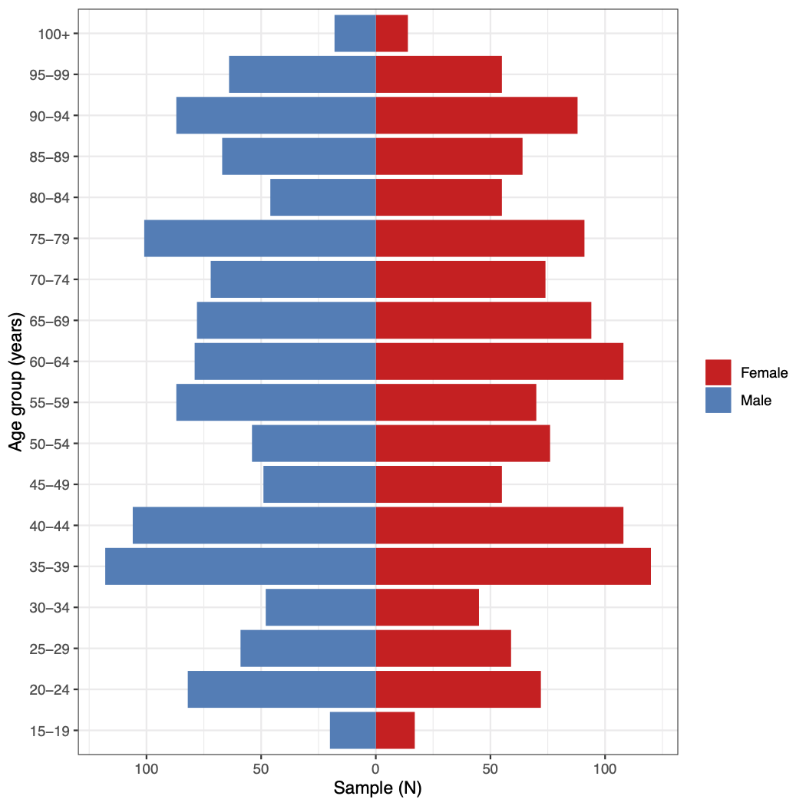
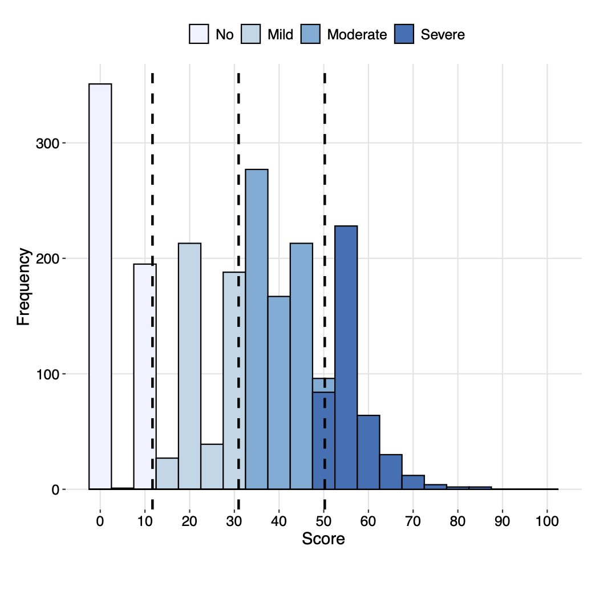
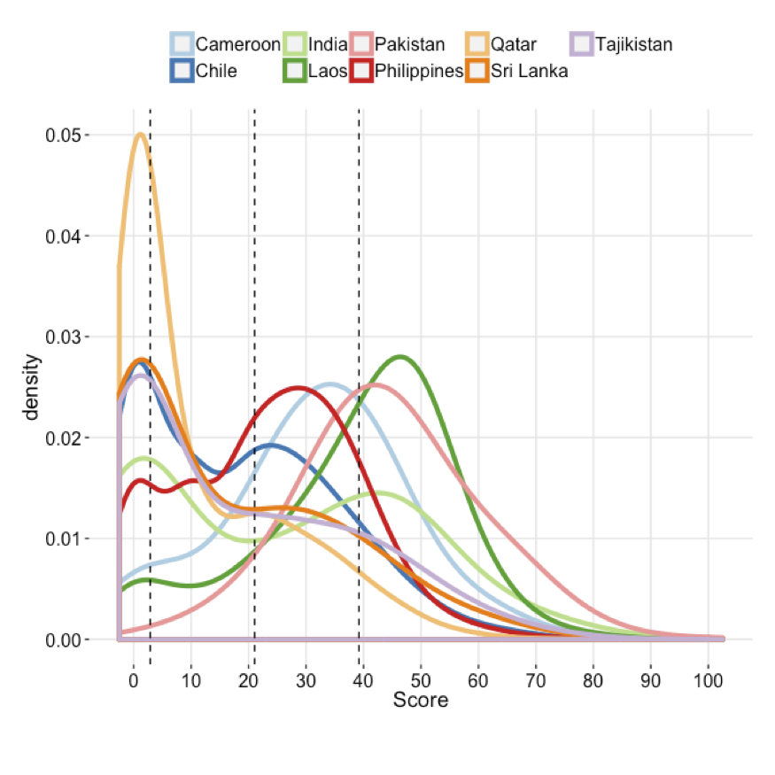

```{r setup, include=FALSE}
library(knitr)
library(tidyr)
library(dplyr)
library(whomds)

opts_chunk$set(warning=FALSE, 
               message=FALSE, 
               eval=FALSE, 
               out.width = "80%",
               fig.align = "center",
               collapse = TRUE,
               comment = "#>",
               survey.lonely.psu = "adjust")

```

# Unir puntajes con datos originales

Una vez que haya terminado con Rasch Analysis, la puntuación se genera en el archivo `Data_final.csv` en la columna llamada `rescaled`. Este archivo solo contendrá los individuos incluidos en el análisis. Cualquier persona que tenga demasiados valores perdidos (`NA`) no estará en este archivo. A menudo es recomendable combinar los datos originales con todos los individuos con las nuevas puntuaciones. Cualquier persona que no haya calculado una puntuación tendrá un `NA` en esta columna.

Esta unión se puede lograr con el siguiente código. Primero, abre el paquete llamada `tidyverse` para acceder a las funciones necesarias. A continuación, lee el archivo `Data_final.csv` y selecciona solo las columnas que necesitas: `ID` (o cualquiera que sea el nombre de la columna de identificación individual en sus datos) y `rescaled`. El siguiente código asume que el archivo está en su directorio operativo. Tendrás que incluir la ruta completa al archivo si no está actualmente en su directorio operativo. Finalmente, puedes crear un objeto `merged_data` que fusione sus datos originales, aquí representados con el objeto `original_data`, con la nueva puntuación en una columna renombrada a `"DisabilityScore"` con el siguiente código:

```{r join-example}
library(tidyverse)
new_score <- read_csv("Data_final.csv") %>% 
  select(c("ID", "rescaled"))
merged_data <- original_data %>% 
  left_join(new_score) %>% 
  rename("DisabilityScore" = "rescaled")
```

Los datos de ejemplo incluidos en el paquete `whomds` llamado `df_adults` ya tienen una puntuación de Rasch combinada, en la columna `disability_score`.

# Después de Rasch: análisis descriptivo

Después de calcular los puntajes de discapacidad con el Análisis Rasch, ahora estás listo para analizar los resultados de la encuesta mediante el cálculo de estadísticas descriptivas. El paquete `whomds` contiene funciones para crear tablas y figuras de estadísticas descriptivas. Esta sección repasará estas funciones.

## Tablas

Las funciones de estadísticas descriptivas incluidas en el paquete `whomds` son:

* `table_weightedpct()` - produce tablas ponderadas de N o %
* `table_unweightedpctn()` - produce tablas no ponderadas de N y %
* `table_basicstats()` - calcula estadísticas básicas del número de miembros por grupo por hogar.

Los argumentos de cada uno de estos códigos se describirán a continuación.

### `table_weightedpct()`

`whomds` contiene una función llamada `table_weightedpct ()` que calcula las tablas de resultados ponderados de la encuesta, desagregadas por variables especificadas. Los argumentos de esta función se pasan a funciones en el paquete `dplyr`.

A continuación se presentan los argumentos de la función:

* `df` - el marco de datos con todas las variables de interés
* `vars_ids` - nombres de variables de los identificadores de cluster de encuesta
* `vars_strata` - nombres de variables de los estratos de la encuesta
* `vars_weights` - nombres de variables de los ponderaciones
* `formula_vars` - vector de los nombres de columna de las variables para las que desea imprimir los resultados
* `...` - captura expresiones para filtrar o transmutar los datos. Vee la descripción del argumento `willfilter` a continuación para más detalles.
* `formula_vars_levels` - vector numérico de los niveles de factor de las variables en `formula_vars`. Por defecto, la función asume que las variables tienen dos niveles: 0 y 1
* `by_vars` - las variables por las que desagregas
* `pct` - una variable lógica que indica si se deben calcular o no los porcentajes ponderados. El valor predeterminado es `TRUE` para porcentajes ponderados. Ajuste a `FALSE` para N ponderada
* `willfilter` - una variable que le dice a la función si filtrarás o no los datos por un valor particular.
    + Por ejemplo, si sus `formula_vars` tienen opciones de respuesta de 0 y 1 pero solo quieres mostrar los valores para 1, entonces diría que `willfilter = TRUE`. Luego, al final de la lista de argumentos, escribe una expresión para el filtro. En este caso, dirías `resp == 1`.
    + Si es `willfilter = FALSE`, entonces la función asumirá que desea "transmutar" los datos, en otras palabras, manipular las columnas de alguna manera, lo que para nosotros a menudo significa combinar las opciones de respuesta. Por ejemplo, si sus `formula_vars` tienen 5 opciones de respuesta, pero solo desea mostrar los resultados para la suma de las opciones `"Agree"` y `"StronglyAgree"`, (después de configurar `spread_key = "resp"` para extender el tabla por las opciones de respuesta) podrías escribir `willfilter = FALSE`, y luego directamente después de escribir la expresión para la transmutación, dándole un nuevo nombre de columna; en este caso, la expresión sería` NewColName = Agree + AgreeStrongly`. También escribe los nombres de las otras columnas que te gustaría mantener en la tabla final.
    + Si deja `willfilter` como su valor predeterminado de `NULL`, la función no filtrará ni transmutará los datos.
* `add_totals`: una variable lógica que determina si se crean filas o columnas totales (según corresponda) que demuestren el margen que suma a 100. Manténlo como el valor predeterminado `FALSE` para no incluir los totales.
* `spread_key` - la variable para la que extiendas la tabla horizontalmente. Mantén como predeterminado `NULL` para no extender la tabla horizontalmente.
* `spread_value` - la variable con la que se llena la tabla después de una extensión horizontal. Por defecto, este argumento es `"prop"`, que es un valor creado internamente por la función y generalmente no necesita ser cambiado.
* `arrange_vars` - la lista de variables para la que organizas la tabla. Mantén como predeterminado `NULL` para dejar el arreglo como está.
* `include_SE` - una variable lógica que indica si se deben incluir los errores estándar en la tabla. Mantén como predeterminado `FALSE` para no incluir errores estándar. A partir de esta versión de `whomds`, no funciona si incluyes totales (`add_totals` es `TRUE`), extensión (`spread_key` no es `NULL`) o transmutación (`willfilter` es `FALSE`).

Aquí hay algunos ejemplos de cómo se usaría `table_weightedpct()` en la práctica. No todos los argumentos se establecen explícitamente en cada ejemplo, lo que significa que se mantienen como sus valores predeterminados.

#### Ejemplo 1: tabla larga, un nivel de desagregación

Digamos que queremos imprimir una tabla del porcentaje de personas en cada nivel de discapacidad que dieron cada opción de respuesta para un conjunto de preguntas sobre el entorno general. Escribiríamos los argumentos de `table_weightedpct()` de esta manera, y las primeras filas de la tabla se verían así:

```{r table-weightedpct-example1, eval=TRUE}
#Quitar NAs de la columna utilizada para el argumento by_vars
df_adults_noNA <- df_adults %>% 
  filter(!is.na(disability_cat))

table_weightedpct(
  df = df_adults_noNA,
  vars_ids = "PSU",
  vars_strata = "strata",
  vars_weights = "weight",
  formula_vars = paste0("EF", 1:12),
  formula_vars_levels = 1:5,
  by_vars = "disability_cat",
  spread_key = NULL,
  spread_value = "prop",
  arrange_vars = NULL,
  willfilter = NULL
  )
```

La tabla de resultados tiene 4 columnas: la variable por la que desagregamos los datos (`disability_cat`, es decir, el nivel de discapacidad), el elemento (`item`), la opción de respuesta (`resp`) y la proporción (`prop`).

#### Ejemplo 2: tabla ancha, un nivel de desagregación

Esta larga tabla del ejemplo anterior es excelente para el análisis de datos, pero no excelente para leer a simple vista. Si queremos hacerlo más bonito, lo convertimos a "formato ancho" mediante "extensión" mediante una variable particular. Tal vez queremos extender por `disability_cat`. Nuestra ejecución de `table_weightedpct()` ahora se vería así, y la tabla de salida sería:

```{r table-weightedpct-example2, eval=TRUE}
table_weightedpct(
  df = df_adults_noNA,
  vars_ids = "PSU",
  vars_strata = "strata",
  vars_weights = "weight",
  formula_vars = paste0("EF", 1:12),
  formula_vars_levels = 1:5,
  by_vars = "disability_cat",
  spread_key = "disability_cat",
  spread_value = "prop",
  arrange_vars = NULL,
  willfilter = NULL
  )
```

Ahora podemos ver que nuestra columna `prop` se ha extendido horizontalmente para cada nivel de` disability_cat`.

#### Ejemplo 3: tabla amplia, un nivel de desagregación, filtrado

Quizás, sin embargo, solo nos interesan las proporciones de la opción de respuesta más extrema de 5. Ahora podríamos agregar un filtro a nuestra ejecución a `table_weightedpct()` así:

```{r table-weightedpct-example3, eval=TRUE}
table_weightedpct(
  df = df_adults_noNA,
  vars_ids = "PSU",
  vars_strata = "strata",
  vars_weights = "weight",
  formula_vars = paste0("EF", 1:12),
  formula_vars_levels = 1:5,
  by_vars = "disability_cat",
  spread_key = "disability_cat",
  spread_value = "prop",
  arrange_vars = NULL,
  willfilter = TRUE,
  resp == 5
  )
```

Ahora puede ver que solo se dan las proporciones para la opción de respuesta de 5.

#### Ejemplo 4: tabla ancha, múltiples niveles de desagregación, filtrada

Con `table_weightedpct()`, también podemos agregar más niveles de desagregación editando el argumento `by_vars`. Aquí produciremos la misma tabla que en el Ejemplo 3 anterior, pero ahora desagregada por nivel de discapacidad y sexo:

```{r table-weightedpct-example4, eval=TRUE}
table_weightedpct(
  df = df_adults_noNA,
  vars_ids = "PSU",
  vars_strata = "strata",
  vars_weights = "weight",
  formula_vars = paste0("EF", 1:12),
  formula_vars_levels = 1:5,
  by_vars = c("disability_cat", "sex"),
  spread_key = "disability_cat",
  spread_value = "prop",
  arrange_vars = NULL,
  willfilter = TRUE,
  resp == 5
  )
```

#### Ejemplo 5: tabla ancha, niveles múltiples de desagregación, transmutada

Quizás todavía estamos interesados no solo en la opción de respuesta 5, sino en la suma de 4 y 5 juntos. Podemos hacer esto "transmutando" nuestra tabla. Para hacer esto, primero elegimos "extender" por `resp` configurando `spread_key = "resp"`. Esto convertirá la tabla a un formato ancho como en el Ejemplo 2, pero ahora cada columna representará una opción de respuesta. Luego configuramos la transmutación estableciendo `willfilter = FALSE`, y agregando expresiones para la transmutación en la siguiente línea. Nombramos todas las columnas que nos gustaría mantener y damos una expresión de cómo crear la nueva columna de la suma de proporciones para las opciones de respuesta 4 y 5, aquí llamada "problemas":

```{r table-weightedpct-example5, eval=TRUE}
table_weightedpct(
  df = df_adults_noNA,
  vars_ids = "PSU",
  vars_strata = "strata",
  vars_weights = "weight",
  formula_vars = paste0("EF", 1:12),
  formula_vars_levels = 1:5,
  by_vars = c("disability_cat", "sex"),
  spread_key = "resp",
  spread_value = "prop",
  arrange_vars = NULL,
  willfilter = FALSE,
  disability_cat, sex, item, problems = `4`+`5`
  )
```

Si nos gustaría extender la tabla nuevamente para que `disability_cat` represente las columnas nuevamente, podemos incluir esta tabla en otra función que realizará la extensión. La función para extender tablas se llama `spread()`, y está en el paquete `tidyr`. Para realizar una segunda extensión, escribe el código así:

```{r table-weightedpct-example5b, eval=TRUE}
table_weightedpct(
  df = df_adults_noNA,
  vars_ids = "PSU",
  vars_strata = "strata",
  vars_weights = "weight",
  formula_vars = paste0("EF", 1:12),
  formula_vars_levels = 1:5,
  by_vars = c("disability_cat", "sex"),
  spread_key = "resp",
  spread_value = "prop",
  arrange_vars = NULL,
  willfilter = FALSE,
  disability_cat, sex, item, problems = `4`+`5`
  ) %>% 
    spread(key = disability_cat, value = problems)
```

El argumento `key` de la función `spread()` le dice a `R` qué variable usar como columnas, y `value` le dice a` R` con qué llenar las columnas. El operador `%>%` se conoce comúnmente como una _"pipe"_. Pone el objeto anterior en el primer argumento de la función posterior. Por ejemplo, si tiene un objeto `x` y una función `f`, escribir `x %>% f ()` sería el equivalente a escribir `f(x)`. Las personas usan _"pipes"_ porque hacen que las secuencias largas de código sean más fáciles de leer.

### `table_unweightedpctn()`

`whomds` contiene una función llamada `table_unweightedpctn()` que produce tablas no ponderadas de N y %. Esto se utiliza generalmente para tablas demográficas. Sus argumentos son los siguientes:

* `df` - el marco de datos con todas las variables de interés
* `vars_demo` - vector con los nombres de las variables demográficas para las que se calcularán N y %
* `group_by_var`: nombre de la variable en la que se deben estratificar las estadísticas (por ejemplo, `"disability_cat"`)
* `spread_by_group_by_var` - determina lógicamente si se debe extender la tabla mediante la variable dada en `group_by_var`. El valor predeterminado es `FALSE`.
* `group_by_var_sums_to_100` - determina lógicamente si los porcentajes suman 100 en el margen de `group_by_var`, si corresponde. El valor predeterminado es `FALSE`.
* `add_totals`: una variable lógica que determina si se crean filas o columnas totales (según corresponda) que demuestren el margen que suma 100. Manténlo como el valor predeterminado `FALSE` para no incluir los totales.

Aquí hay un ejemplo de cómo se usa:

```{r table-unweightedpctn-example, eval=TRUE}
table_unweightedpctn(df_adults_noNA, 
                     vars_demo = c("sex", "age_cat", "work_cat", "edu_cat"), 
                     group_by_var = "disability_cat", 
                     spread_by_group_by_var = TRUE)
```


### `table_basicstats()`

La función `table_basicstats()` calcula estadísticas básicas del número de miembros por grupo por hogar. Sus argumentos son:

* `df` - un marco de datos de datos de hogares donde las filas representan miembros de los hogares en la muestra
* `hh_id` - cadena (longitud 1) que indica el nombre de la variable en `df` que identifica hogares únicamente
* `group_by_var` - cadena (longitud 1) con el nombre de la variable en `df` para la que se agrupa los resultados

Aquí hay un ejemplo de cómo se usa:

```{r table-basicstats-example, eval=TRUE}
table_basicstats(df_adults_noNA, "HHID", "age_cat")
```


## Figuras

Las funciones de las estadísticas descriptivas incluidas en el paquete `whomds` son:

* `fig_poppyramid()` - produce una figura de pirámide de población para la muestra
* `fig_dist()` - produce un gráfico de la distribución de una puntuación
* `fig_density()` - produce un gráfico de la densidad de una puntación

Los argumentos de cada uno de estos códigos se describirán a continuación.

### `fig_poppyramid()`

`whomds` contiene una función llamada `fig_poppyramid()` que produce una figura de pirámide de población para la muestra. Esta función toma como argumentos:

* `df` - los datos donde cada fila es un miembro del hogar de la lista del hogar
* `var_age` - el nombre de la columna en `df` con las edades de las personas
* `var_sex` - el nombre de la columna en `df` con los sexos de las personas
* `x_axis` - una cadena que indica si se deben usar números absolutos o porcentaje de muestra en el eje horizontal. Las opciones son `"n"` (predeterminado) o `"pct"`.
* `age_plus` - un valor numérico que indica la edad que es el primer valor del grupo de edad más antiguo. El valor predeterminado es 100, para el último grupo de edad de 100 o más.
* `age_by` - un valor numérico que indica el ancho de cada grupo de edad, en años. El valor predeterminado es 5.

Ejecutar esta función produce una figura como la siguiente:

```{r plot-pop-pyramid, eval=TRUE, echo=FALSE}

```


### `fig_dist()` 

`whomds` contiene una función llamada `fig_dist()` que produce un gráfico de la distribución de una puntuación. La OMS utiliza esta función para mostrar la distribución de las puntuaciones de discapacidad calculadas con el Análisis de Rasch. Sus argumentos son:

* `df` - marco de datos con la puntuación de interés
* `score` - variable de carácter del nombre de variable de puntuación que va de 0 a 100; ej. `"disability_score"`
* `score_cat` - variable de carácter del nombre de variable de categorización de puntuación, ej. `"disability_cat"`
* `cutoffs` - un vector numérico de los puntos de corte para la categorización de puntuación
* `x_lab` - una cadena que da la etiqueta del eje horizontal. El valor predeterminado es `"Score"`
* `y_max` - valor máximo para usar en el eje vertical. Si se deja como predeterminado `NULL`, la función calculará un máximo adecuado automaticamente.
* `pcent` - variable lógica que indica si se debe usar el porcentaje en el eje y o la frecuencia. Deje por defecto `FALSE` para la frecuencia y dé `TRUE` para el porcentaje.
* `pal` - una cadena que especifica el tipo de paleta de colores a usar, que se pasa a la función `RColorBrewer::brewer.pal()`. El valor predeterminado es `"Blues"`.
* `binwidth` - un valor numérico que da el ancho de los contenedores en el histógrafo. El valor predeterminado es 5.

Ejecutar esta función produce una figura como la de abajo.

```{r plot-distribution, eval=TRUE, echo=FALSE}

```


### `fig_density()`

`whomds` contiene una función similar a `fig_dist()` llamada `fig_density()` que produce un gráfico de la densidad de una puntuación. La OMS utiliza esta función para mostrar la distribución de densidad de las puntuaciones de discapacidad calculadas con el Análisis de Rasch. Sus argumentos son:

* `df` - marco de datos con la puntuación de interés
* `score` - variable de carácter del nombre de variable de puntuación que va de 0 a 100; ej. `"disability_score"`
* `var_color` - variable de carácter con el nombre de la columna que se usa para determinar los colores de las líneas de densidad. Se usa este variable para imprimir las densidades de diferentes groups en el mismo gráfico. El valor predeterminado es `NULL`.
* `var_facet` - variable de carácter con el nombre de la columna que se usa para crear un gráfico con `ggplot2::facet_grid()`, que se imprime las densidades de diferentes groups lado a lado. El valor predeterminado es `NULL`.
* `cutoffs` - un vector numérico de los puntos de corte para la categorización de puntuación
* `x_lab` - una cadena que da la etiqueta del eje horizontal. El valor predeterminado es `"Score"`
* `pal` - una cadena que especifica un color manual para utilizar para el aestitico del color, un vector de carácter que especifica los colores que se usa para la escala de colores, o como el tipo de paleta de colores a usar para la escala de colores, que se pasa a la función `RColorBrewer::brewer.pal()`. El valor predeterminado es  `"Paired"`
* `adjust` - un valor numérico que se pasa al argumento `adjust` de `ggplot2::geom_density()`, que suaviza la función de la densidad. El valor predeterminado es 2.
* `size` - un valor numérico que se pasa al argumento `size` de `ggplot2::geom_density()`, que controla el espesor de las líneas. El valor predeterminado es 1.5.

Ejecutar esta función produce una figura como la de abajo.

```{r plot-density, eval=TRUE, echo=FALSE}

```


## Plantillas para estadísticas descriptivas

La OMS también proporciona una plantilla para calcular muchas tablas de estadísticas descriptivas para su uso en informes de encuestas, también escritas en `R`. Si desea una plantilla para su país, contáctenos (por favor abre el archivo DESCRIPTION para obtender los detalles de contacto).
